# Autonomous Trading Desk (ATD) ⚡🏛️

[](https://www.python.org/downloads/)
[](https://opensource.org/licenses/MIT)
[](https://www.binance.com)
[]()
[]()

> **Institutional-Grade Quantitative Agentic Trading Framework with Fail-Closed Mechanical Gates & Clean-Room Context Architecture.**

Autonomous Trading Desk (ATD) bridges the gap between frontier Artificial Intelligence agents and rigorous financial engineering. Unlike naive "AI trading bots" that prompt an LLM directly to predict prices, ATD implements a **deterministic 8-layer multi-agent harness** where code-level gates physically enforce risk limits, clean-room subagents evaluate opportunities in ephemeral isolation, and atomic order verification eliminates unhedged execution risk.

---

## 🏗️ Architectural Topology (The 8 Layers)

```mermaid
graph TD
    subgraph L0 ["Layer 0: Pre-Flight Doctor & Health Sensor"]
        DOC["scripts/trading_doctor.py<br/>• Latency < 800ms<br/>• Clock Drift < 1000ms<br/>• Orphan Position Auto-Heal"]
    end

    subgraph L1 ["Layer 1: Ground Truth Ledger"]
        SYNC["scripts/sync_session_state.py<br/>• Direct Binance Ledger Sync (~600ms)<br/>• Single Source of Truth: session_state.json"]
    end

    subgraph L2 ["Layer 2: Mechanical Hard Gates (PreToolUse Hook)"]
        GATE["scripts/hooks/pre_trade_guard.py<br/>• Delta-Neutral Gate (Block Longs on LONG_HEAVY)<br/>• Risk Gate (Cap Max Dollar Loss at $1.50)<br/>• Financial Friction Floor (TP1 > 0.50%)"]
    end

    subgraph L3 ["Layer 3: Deterministic Context Primer"]
        BRIEF["scripts/prime_evaluator_brief.py<br/>• Compacts 35k chat tokens into &lt; 1,800 token brief<br/>• Zero information loss, zero hallucination"]
    end

    subgraph L4 ["Layer 4: Clean-Room Isolated Evaluator"]
        EVAL["isolated_market_evaluator (Ephemeral Subagent)<br/>• Canonical XML Hierarchy<br/>• Negative Few-Shots (Anti-Hyper-Triggering)<br/>• &lt;thinking&gt; 4-Step Precondition Checklist<br/>• Typed &lt;dossier_json&gt; Contract"]
    end

    subgraph L5 ["Layer 5: Fail-Closed Atomic Execution"]
        EXEC["scripts/execute_futures_trade.py<br/>• Isolated Margin 3x (15x YOLO)<br/>• Volatility Parity Sizing ($1.50 Constant Risk)<br/>• Atomic Stop Loss Verification (3 Retries)<br/>• Immediate Auto-Destruct if unhedged"]
    end

    subgraph L6 ["Layer 6: Committed Memory"]
        MEM["scripts/remember_trade_lesson.py<br/>• Append-Only Forensic Lessons (trade_insights.jsonl)<br/>• Shock vs Normal Variance Classification"]
    end

    subgraph L7 ["Layer 7: Night Cutoff Loop"]
        LOOP["scripts/loops/night_cutoff_loop.py<br/>• True Net Break-Even Ratchet (+0.2% fee cushion)<br/>• Expired Order Reaper (>60m)<br/>• Zero Risk Overnight"]
    end

    DOC --> SYNC --> GATE --> BRIEF --> EVAL --> EXEC --> MEM --> LOOP
```



---

## 💡 Core Engineering Principles

### 1. Deterministic Mechanical Hard Gates (PreToolUse Interception)
Natural language instructions are not a reliable safety barrier in live financial trading. ATD rejects the antipattern of relying on the LLM's stochastic memory to enforce risk boundaries. Instead, runtime **PreToolUse hooks intercept every tool call at the operating system level**. If the portfolio ledger indicates `LONG_HEAVY`, attempts to execute a `LONG` order are mechanically blocked with `hard_gate_rejection: True` before any network packet reaches the exchange API.

### 2. Clean-Room Context Isolation
Long conversational histories accumulate token baggage, emotional bias from past streaks, and prompt drift. ATD packs real-time exchange data into an ultra-dense brief (< 1,800 tokens) and spawns an ephemeral clean-room evaluator (`isolated_market_evaluator`) with:
* **Canonical XML Hierarchy:** `<identity_and_role>`, `<operational_rules>`, `<negative_constraints>`, `<deliberation_protocol>`, `<few_shot_examples>`, `<output_contract>`.
* **Negative Few-Shots:** Explicit exemplars training the agent when **NOT** to act (e.g. aborting Longs on Delta gates, rejecting low-volume "Fake Tier S" setups, suppressing redundant search calls).
* **Forced Deliberation Checklist:** A mandatory 4-step boolean verification protocol inside `<thinking>` before emitting recommendations.

### 3. Fail-Closed Atomic Execution
Placing an entry order without an active Stop Loss is unacceptable. ATD queries Binance algo orders (`/fapi/v1/openAlgoOrders`) with up to 3 progressive retries (~2.8s). If the Stop Loss fails to index, **the bot immediately triggers auto-destruct and closes the position at market (`reduceOnly=true`)**, ensuring zero unhedged exposure.

---

## 📊 Dual-Engine Operational Alpha

ATD operates a complementary dual-engine framework:

```
┌────────────────────────────────────────────────────────────────────────┐
│                   DUAL-ENGINE OPERATIONAL DESK                         │
├──────────────────────────────────┬─────────────────────────────────────┤
│ MOTOR 1: Intraday Desk (15m/5m)  │ MOTOR 2: Stat-Arb & Yield Desk (1h) │
├──────────────────────────────────┼─────────────────────────────────────┤
│ • Momentum & Mean-Reversion      │ • Cointegrated Pairs Stat-Arb       │
│ • Volatility Parity Sizing       │ • Engle-Granger MacKinnon (2010)    │
│   ($1.50 constant dollar risk)   │   Critical values (p < 0.05, 1000b) │
│ • Structural Trailing Stop 15m   │ • Hurwicz-Corrected Half-Life       │
│ • True Net Break-Even (+0.2%)    │   (3h <= H <= 72h)                  │
│ • Taleb Barbell YOLO Moonshot    │ • Dynamic Beta Hedging (Δ ≈ 0)      │
│   (Isolated 15x, $10 cap,        │ • Cash & Carry Funding Harvest      │
│    Zero premature truncation)    │   (Hurdle Rate >= 25% APR)          │
│ • Session Cutoff / Zero Night    │ • Multi-day horizon with neutral    │
│   unhedged exposure              │   directional risk                  │
└──────────────────────────────────┴─────────────────────────────────────┘
```

---

## 🚀 Quickstart

### Prerequisites
* Linux / WSL2 (Ubuntu 22.04+ recommended)
* Python 3.10+
* Binance Futures Account (Testnet or Mainnet)

### 1. Installation
```bash
git clone https://github.com/IgnacioN99/autonomous-trading-desk.git
cd autonomous-trading-desk

python3 -m venv venv
source venv/bin/activate
pip install -r requirements.txt
```

### 2. Environment Configuration
Copy the template and fill in your Binance API credentials:
```bash
cp .env.example .env
nano .env
```

```ini
BINANCE_API_KEY=your_key_here
BINANCE_SECRET_KEY=your_secret_here
BINANCE_API_ENV=TESTNET  # Start in TESTNET for free sandbox experimentation
```

### 3. Run Pre-Flight Doctor (Layer 0)
Validates latency, clock drift, API permissions, balance, and audits for orphan positions without Stop Loss:
```bash
python3 scripts/trading_doctor.py
```

### 4. Sync Ground Truth Ledger (Layer 1)
Synchronizes session state against Binance in ~600ms:
```bash
python3 scripts/sync_session_state.py
```

### 5. Screen Market & Prime Context (Layers 2 & 3)
Concurrent radar across 80+ contracts with Order Flow, CVD, and Taker volume analysis:
```bash
python3 scripts/broad_market_radar.py
python3 scripts/prime_evaluator_brief.py --json
```

### 6. Automated GitHub Issue Reporting & Observability (Native Shell Tool)
If subagents, hooks, or loops encounter unexpected failures, unhandled exceptions, or infrastructure drift, the agent directly invokes the native bash reporter (`run_command`) with zero Python runtime dependencies:
```bash
# Native bash execution by the agent or operator:
./scripts/report_issue.sh --title "Endpoint timeout in ticker stream" --error "ReadTimeout at /fapi/v1/ticker/24hr" --severity "HIGH" --category "infra"

# If offline or GITHUB_TOKEN is pending, issues are safely queued in logs/issues_backlog.jsonl. Sync them with:
./scripts/report_issue.sh --sync
```

---

## 📂 Repository Structure

```
autonomous-trading-desk/
├── .agents/
│   └── hooks.json                     # PreToolUse security hook configuration
├── docs/
│   ├── agent_prompt_engineering_guide.md  # 60KB definitive agent prompt manual
│   └── flujo_operativo_2026-09-23.md      # Operational trace & execution walkthrough
├── prompts/
│   └── subagents/
│       └── isolated_market_evaluator.md  # Production XML prompt with Negative Few-Shots
├── research/
│   ├── 01_kelly_criterion_crypto_risk.md
│   ├── 02_spot_cvd_order_flow_absorptions.md
│   ├── 03_stop_hunt_neutralization_atr_buffers.md
│   └── 04_funding_rate_arbitrage_and_liquidations.md
├── scripts/
│   ├── adapters/
│   │   └── exchange_adapter.py        # Exchange seam abstraction
│   ├── hooks/
│   │   ├── pre_trade_guard.py         # Mechanical hard gate hook (<15ms)
│   │   └── post_trade_sync.py         # Auto ground-truth sync on fills
│   ├── loops/
│   │   ├── night_cutoff_loop.py       # Zero overnight risk manager
│   │   └── trading_drift_watchdog.py  # Dead alpha detector
│   ├── utils/
│   │   └── atomic_writer.py           # POSIX atomic ledger persistence
│   ├── broad_market_radar.py          # Concurrent 80+ pair screener
│   ├── dynamic_exit_manager.py        # Chandelier ATR structural trailing stop
│   ├── execute_futures_trade.py       # Fail-closed order deployment engine
│   ├── fetch_newsletters.py           # Tagged research email parser
│   ├── funding_arbitrage.py           # Cash-and-carry & delta-neutral pairs
│   ├── market_regime.py               # Macro BTC regime classifier
│   ├── microstructure_engine.py       # CVD, taker ratios, tape imbalance
│   ├── prime_evaluator_brief.py       # Context packing engine (<1,800 tokens)
│   ├── quant_risk_engine.py           # MacKinnon 2010 cointegration & Kelly sizing
│   ├── record_evaluation.py           # Atomic dossier registration & token gate
│   ├── remember_trade_lesson.py       # Append-only immutable memory
│   ├── report_agent_issue.py          # Python issue reporter module
│   ├── report_issue.sh                # Native bash issue reporter tool
│   ├── sync_session_state.py          # Real Binance ledger synchronization
│   └── trading_doctor.py              # Pre-flight diagnostic & self-healing
├── .env.example                       # Sanitized credentials template
├── .gitignore                         # Zero-leak security exclusions
├── AGENTS.md                          # Standard Operating Procedure (SOP)
├── LICENSE                            # MIT License
└── requirements.txt                   # Quantitative & async dependencies
```

---

## 📖 In-Depth Documentation

* **[Agent Prompt Engineering Guide](docs/agent_prompt_engineering_guide.md):** 60 KB comprehensive guide covering XML tag scoping, BPE attention routing, negative few-shots, KV cache optimization (>90% hit rate), and deliberation scratchpads.
* **[Operating SOP (AGENTS.md)](AGENTS.md):** The operational handbook defining execution phases, sizing mathematics, and night cutoff protocols.
* **[Research Notebooks](research/):** Deep-dive mathematical foundations on the Kelly Criterion, CVD order flow absorptions, ATR stop hunt neutralization, and funding arbitrage.

---

## 🛡️ Security & Fail-Closed Guarantee

1. **Zero Credential Commits:** Strictly enforced via exhaustive `.gitignore`.
2. **Atomic Dossier Verification:** The execution hook requires a fresh (<20 min) signed dossier in `logs/evaluations/latest_dossier.json` before allowing order dispatch.
3. **Environment Separation:**
   * **PROD:** All gates (Delta-Neutral, Dollar Risk, Transaction Fee Floor) are 100% rigid. Zero exceptions.
   * **TESTNET:** Gates can be bypassed via explicit command flags (`--bypass-delta-gate`, `--bypass-eval-gate`) for stress testing and exploratory development.

---

## ⚖️ Disclaimer

*This software is for educational, research, and algorithmic experimentation purposes. Cryptocurrency futures trading involves substantial financial risk. The authors and contributors assume no responsibility for financial losses incurred through the deployment of this codebase.*

---

## 📄 License

Distributed under the **MIT License**. See [`LICENSE`](LICENSE) for details.
