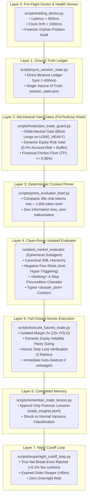

# Autonomous Trading Desk (ATD) ⚡🏛️

[](https://www.python.org/downloads/)
[](https://opensource.org/licenses/MIT)
[](https://www.binance.com)
[]()
[]()

> **Institutional-Grade Quantitative Agentic Trading Framework with Fail-Closed Mechanical Gates & Clean-Room Context Architecture.**

Autonomous Trading Desk (ATD) bridges the gap between frontier Artificial Intelligence agents and rigorous financial engineering. Unlike naive "AI trading bots" that prompt an LLM directly to predict prices, ATD implements a **deterministic 8-layer multi-agent harness** where code-level gates physically enforce risk limits, clean-room subagents evaluate opportunities in ephemeral isolation, and atomic order verification eliminates unhedged execution risk.

---

## 🖥️ Supported Execution Runtimes

ATD is built to operate across modern agentic runtimes without lock-in:

1. **Antigravity IDE / CLI Native:** Full harness integration with deterministic lifecycle hooks configured via [`.agents/hooks.json`](.agents/hooks.json). PreToolUse security gates intercept tool calls in `<15ms`.
2. **Claude Code:** Full harness parity via [`.claude/settings.json`](.claude/settings.json), enforcing PreToolUse choke-point validation and PostToolUse ground-truth ledger synchronization on all bash and tool operations.
3. **Standalone CLI / Automated Scripts:** Every core engine (`scripts/trading_doctor.py`, `scripts/sync_session_state.py`, `scripts/execute_futures_trade.py`, `scripts/broad_market_radar.py`) runs deterministically from standard bash shells with identical fail-closed software gates.

---

## 🏗️ Architectural Topology (The 8 Layers)


```mermaid
graph TD
    subgraph L0 ["Layer 0: Pre-Flight Doctor & Health Sensor"]
        DOC["scripts/trading_doctor.py<br/>• Latency < 800ms<br/>• Clock Drift < 1000ms<br/>• Forensic Orphan Position Audit"]
    end

    subgraph L1 ["Layer 1: Ground Truth Ledger"]
        SYNC["scripts/sync_session_state.py<br/>• Direct Binance Ledger Sync (~600ms)<br/>• Single Source of Truth: session_state.json"]
    end

    subgraph L2 ["Layer 2: Mechanical Hard Gates (PreToolUse Hook)"]
        GATE["scripts/hooks/pre_trade_guard.py<br/>• Delta-Neutral Gate (Block Longs on LONG_HEAVY)<br/>• Dynamic Equity Risk Gate (0.5% Account Risk + Buffer)<br/>• Financial Friction Floor (TP1 >= 0.35%)"]
    end

    subgraph L3 ["Layer 3: Deterministic Context Primer"]
        BRIEF["scripts/prime_evaluator_brief.py<br/>• Compacts 35k chat tokens into &lt; 1,800 token brief<br/>• Zero information loss, zero hallucination"]
    end

    subgraph L4 ["Layer 4: Clean-Room Isolated Evaluator"]
        EVAL["isolated_market_evaluator (Ephemeral Subagent)<br/>• Canonical XML Hierarchy<br/>• Negative Few-Shots (Anti-Hyper-Triggering)<br/>• &lt;thinking&gt; 4-Step Precondition Checklist<br/>• Typed &lt;dossier_json&gt; Contract"]
    end

    subgraph L5 ["Layer 5: Fail-Closed Atomic Execution"]
        EXEC["scripts/execute_futures_trade.py<br/>• Isolated Margin 3x (15x YOLO)<br/>• Dynamic Equity Volatility Parity Sizing<br/>• Atomic Stop Loss Verification (3 Retries)<br/>• Immediate Auto-Destruct if unhedged"]
    end

    subgraph L6 ["Layer 6: Committed Memory"]
        MEM["scripts/remember_trade_lesson.py<br/>• Append-Only Forensic Lessons (trade_insights.jsonl)<br/>• Shock vs Normal Variance Classification"]
    end

    subgraph L7 ["Layer 7: Night Cutoff Loop"]
        LOOP["scripts/loops/night_cutoff_loop.py<br/>• True Net Break-Even Ratchet (+0.2% fee cushion)<br/>• Expired Order Reaper (>90m)<br/>• Zero Overnight Risk"]
    end

    DOC --> SYNC --> GATE --> BRIEF --> EVAL --> EXEC --> MEM --> LOOP
```

---

## 💡 Core Engineering Principles

### 1. Deterministic Mechanical Hard Gates (PreToolUse Interception)
Natural language instructions are not a reliable safety barrier in live financial trading. ATD rejects the antipattern of relying on the LLM's stochastic memory to enforce risk boundaries. Instead, runtime **PreToolUse hooks physically intercept every order execution attempt at the OS level**:
- **Single Choke Point Enforcement:** Direct calls to exchange order tools are mechanically blocked. All orders must pass through `scripts/execute_futures_trade.py` or the approved MCP wrapper (`crypto_radar:deploy_futures_trade`).
- **Mandatory Clean-Room Evaluation:** Orders require a valid, non-expired (<20m) signed evaluation dossier in `logs/evaluations/latest_dossier.json` approving the symbol.
- **Delta-Neutral Gate:** If the portfolio marks `LONG_HEAVY`, attempts to execute a `LONG` order are rejected with `hard_gate_rejection: True` before any network packet reaches the exchange API. If `SHORT_HEAVY`, additional `SHORT` orders are blocked.
- **Dynamic Equity Risk Gate:** Maximum monetary loss is capped to the user's calibrated equity risk profile (default 0.5% of Account Equity + 1.25x buffer, e.g. ~$50 on $10k, $5 on $1k, $0.50 on $100), dynamically verified against live balance.
- **Financial Friction Floor:** Orders where distance to TP1 is less than 0.35% are physically blocked, ensuring taker fees and bid-ask spread never consume the statistical edge.
- **Leverage Ceiling Gate:** Absolute desk ceiling of 15x; standard positions are restricted to 3x-5x unless explicitly flagged as YOLO moonshots.

### 2. Clean-Room Context Isolation
Long conversational histories accumulate token baggage, emotional bias from past streaks, and prompt drift. ATD packs real-time exchange data into an ultra-dense brief (< 1,800 tokens) and spawns an ephemeral clean-room evaluator (`isolated_market_evaluator`) with:
* **Canonical XML Hierarchy:** `<identity_and_role>`, `<operational_rules>`, `<negative_constraints>`, `<deliberation_protocol>`, `<few_shot_examples>`, `<output_contract>`.
* **Negative Few-Shots:** Explicit exemplars training the agent when **NOT** to act (e.g. aborting Longs on Delta gates, rejecting low-volume "Fake Tier S" setups, suppressing redundant search calls).
* **Forced Deliberation Checklist:** A mandatory 4-step boolean verification protocol inside `<thinking>` before emitting recommendations.

### 3. Fail-Closed Atomic Execution
Placing an entry order without an active Stop Loss is unacceptable. ATD queries Binance algo orders (`/fapi/v1/openAlgoOrders`) with up to 3 progressive retries (~2.8s) to absorb Mainnet indexing latency. If the Stop Loss fails to index, **the bot immediately triggers auto-destruct and closes the position at market (`reduceOnly=true`)**, guaranteeing zero unhedged exposure.

---

## 📊 Dual-Engine Operational Alpha

ATD operates a complementary dual-engine framework:

```
┌────────────────────────────────────────────────────────────────────────┐
│                   DUAL-ENGINE OPERATIONAL DESK                         │
├──────────────────────────────────┬─────────────────────────────────────┤
│ MOTOR 1: Intraday Desk (15m/5m)  │ MOTOR 2: Stat-Arb & Yield Desk (1h) │
├──────────────────────────────────┼─────────────────────────────────────┤
│ • Momentum & Mean-Reversion      │ • Cointegrated Pairs Stat-Arb       │
│ • Volatility Parity Sizing       │ • Engle-Granger MacKinnon (2010)    │
│   (0.5% account equity risk)     │   Critical values (p < 0.05, 1000b) │
│ • Structural Trailing Stop 15m   │ • Hurwicz-Corrected Half-Life       │
│ • True Net Break-Even (+0.2%)    │   (3h <= H <= 72h)                  │
│ • Taleb Barbell YOLO Moonshot    │ • Dynamic Beta Hedging (Δ ≈ 0)      │
│   (Isolated 15x, isolated cap,   │ • Cash & Carry Funding Harvest      │
│    Zero premature truncation)    │   (Hurdle Rate >= 25% APR)          │
│ • Session Cutoff / Zero Night    │ • Multi-day horizon with neutral    │
│   unhedged exposure              │   directional risk                  │
└──────────────────────────────────┴─────────────────────────────────────┘
```

---

## 🚀 Complete Quickstart (Safe Sandbox First)

Follow these steps to deploy a safe, clone-ready environment. **TESTNET (Sandbox)** is the default recommended mode for all new setups.

### Step 1: Clone & Install Dependencies
```bash
git clone https://github.com/IgnacioN99/autonomous-trading-desk.git
cd autonomous-trading-desk

python3 -m venv venv
source venv/bin/activate
pip install -r requirements.txt
```

### Step 2: Environment Setup (Safe Testnet Default)
Copy the safe sandbox configuration template to `.env`:
```bash
# Copy the Testnet sandbox configuration as your default .env
cp config/environments/testnet.env .env
# (Alternatively, copy from template: cp config/environments/testnet.env.example .env)
```

Edit `.env` to include your Binance Futures Testnet API credentials (obtain free testnet keys at [testnet.binancefuture.com](https://testnet.binancefuture.com)):
```ini
# Target execution environment: TESTNET (default sandbox)
BINANCE_API_ENV=TESTNET

# Binance Futures Testnet API Credentials
BINANCE_API_KEY=your_testnet_api_key_here
BINANCE_SECRET_KEY=your_testnet_secret_key_here
BINANCE_FUTURES_BASE_URL=https://testnet.binancefuture.com
```

### Step 3: Interactive Onboarding & Risk Calibration
Run the interactive profiler to configure your risk profile (`config/user_profile.json`):
```bash
python3 scripts/user_profile.py --setup
```
This configures:
- Risk percentage per trade (default 0.5% equity on Stop Loss, e.g. ~$50 on $10k equity, $5 on $1k equity, $0.50 on $100 equity).
- Maximum margin ratio ceiling (30% per trade).
- Maximum concurrent open positions (default: 3).
- Overnight handling mode (`ZERO_OVERNIGHT_RISK`).
- Taleb Barbell YOLO moonshot preference.

### Step 4: Run Pre-Flight System Diagnostic (Layer 0)
Verify network latency, clock drift, credentials, account balance, and ensure zero unhedged orphan positions exist on Binance:
```bash
python3 scripts/trading_doctor.py
```
Expected output:
```text
=================================================================
🩺 TRADING DOCTOR — PRE-FLIGHT SYSTEM DIAGNOSTIC
Target Environment: TESTNET
=================================================================
✅ [API KEYS] Credentials OK (TESTNET)
ℹ️  [SAFETY FLAG] Sandbox mode (Testnet). LIVE_TRADING_ARMED flag not required.
✅ [NETWORK] API latency: 142ms
✅ [CLOCK DRIFT] Clock synchronization OK (18ms)
✅ [BALANCE] Available Margin: 10,000.00 USDT
✅ [ORPHAN AUDIT] Clean ledger. 0 open positions.
=================================================================
🩺 SYSTEM HEALTH: OPTIMAL (0 critical failures, 0 warnings)
Ready for algorithmic execution.
=================================================================
```

### Step 5: (Optional) Notion & Research Setup
To enable automated journaling and research newsletter ingestion:
1. Copy the user context template:
   ```bash
   cp config/user_context.json.example config/user_context.json
   ```
2. Follow [`docs/notion_setup_guide.md`](docs/notion_setup_guide.md) to link your Notion database (`Trading Journal - Futures`).
3. Add Gmail app credentials to `.env` if you wish to parse crypto research newsletters via `scripts/fetch_newsletters.py`.

---

## 🕹️ Everyday Operations

### 1. Synchronize Ledger Ground Truth (Layer 1)
Sync session state against Binance in ~600ms:
```bash
python3 scripts/sync_session_state.py
```

### 2. Screen Market & Prime Context (Layers 2 & 3)
Run concurrent radar across 80+ contracts with Order Flow, CVD, and Taker volume analysis:
```bash
python3 scripts/broad_market_radar.py
python3 scripts/prime_evaluator_brief.py --json
```

### 3. Automated GitHub Issue Reporting & Observability
If subagents, hooks, or loops encounter unexpected failures, unhandled exceptions, or infrastructure drift, the system directly invokes the native bash reporter (`report_issue.sh`):
```bash
./scripts/report_issue.sh --title "Endpoint timeout in ticker stream" --error "ReadTimeout at /fapi/v1/ticker/24hr" --severity "HIGH" --category "infra"

# If offline or GITHUB_TOKEN is pending, issues are safely queued in logs/issues_backlog.jsonl. Sync them with:
./scripts/report_issue.sh --sync
```

---

## 📂 Repository Structure

```
autonomous-trading-desk/
├── .agents/
│   ├── hooks.json                     # Antigravity PreToolUse/PostToolUse hook configuration
│   └── skills/
│       └── trade-execution-planner/   # Core execution & market radar skill
├── .claude/
│   └── settings.json                  # Claude Code PreToolUse/PostToolUse safety hooks
├── config/
│   ├── environments/
│   │   ├── prod.env.example           # Production environment credentials template
│   │   ├── testnet.env                # Local Testnet configuration (safe sandbox default)
│   │   └── testnet.env.example        # Tracked Testnet sandbox template
│   ├── user_context.json.example      # NotebookLM, newsletter, and Notion context template
│   └── user_profile.json.example      # Risk appetite & dynamic profile template
├── docs/
│   ├── agent_prompt_engineering_guide.md # Definitive agent prompt manual
│   └── notion_setup_guide.md          # Step-by-step Notion Trading Journal integration guide
├── prompts/
│   └── subagents/
│       └── isolated_market_evaluator.md # Clean-room XML prompt with Negative Few-Shots
├── research/
│   ├── 01_kelly_criterion_crypto_risk.md
│   ├── 02_spot_cvd_order_flow_absorptions.md
│   ├── 03_stop_hunt_neutralization_atr_buffers.md
│   └── 04_funding_rate_arbitrage_and_liquidations.md
├── scripts/
│   ├── adapters/
│   │   └── exchange_adapter.py        # Exchange seam abstraction
│   ├── hooks/
│   │   ├── pre_trade_guard.py         # Mechanical hard gate hook (<15ms, fail-closed)
│   │   └── post_trade_sync.py         # Auto ground-truth sync on fills
│   ├── loops/
│   │   └── night_cutoff_loop.py       # Zero overnight risk manager & order reaper
│   ├── utils/
│   │   ├── atomic_writer.py           # POSIX atomic ledger persistence
│   │   └── env_resolver.py            # Centralized environment resolver & security enforcer
│   ├── broad_market_radar.py          # Concurrent 80+ pair screener (15m/5m/1h)
│   ├── dynamic_exit_manager.py        # Chandelier ATR structural trailing stop
│   ├── execute_futures_trade.py       # Fail-closed order deployment engine & hard gates
│   ├── fetch_newsletters.py           # Gmail research email parser & catalyst detector
│   ├── funding_arbitrage.py           # Cash-and-carry & delta-neutral pairs
│   ├── market_regime.py               # Macro BTC regime classifier
│   ├── microstructure_engine.py       # CVD, taker ratios, tape imbalance
│   ├── prime_evaluator_brief.py       # Context packing engine (<1,800 tokens)
│   ├── quant_risk_engine.py           # MacKinnon 2010 cointegration & dynamic equity sizing
│   ├── radar_mcp_server.py            # Official MCP server for trading radar
│   ├── record_evaluation.py           # Atomic dossier registration & token gate
│   ├── remember_trade_lesson.py       # Append-only immutable memory
│   ├── report_agent_issue.py          # Python issue reporter module
│   ├── report_issue.sh                # Native bash issue reporter tool
│   ├── sync_notion_journal.py         # Notion Journal reconciler vs Binance ledger
│   ├── sync_session_state.py          # Real Binance ledger synchronization (~600ms)
│   ├── trading_doctor.py              # Pre-flight diagnostic & health sensor
│   ├── trading_drift_watchdog.py      # Dead alpha detector & telemetry watchdog
│   └── user_profile.py                # User profile & onboarding profiler
├── .env.example                       # Sanitized credentials template (Testnet default)
├── .gitignore                         # Zero-leak security exclusions
├── AGENTS.md                          # Standard Operating Procedure (SOP)
├── LICENSE                            # MIT License
└── requirements.txt                   # Quantitative & async dependencies
```

---

## 📖 In-Depth Documentation

* **[Operating SOP (AGENTS.md)](AGENTS.md):** The operational handbook defining execution phases, sizing mathematics, and night cutoff protocols.
* **[Agent Prompt Engineering Guide](docs/agent_prompt_engineering_guide.md):** 60 KB comprehensive guide covering XML tag scoping, BPE attention routing, negative few-shots, KV cache optimization (>90% hit rate), and deliberation scratchpads.
* **[Notion Setup Guide](docs/notion_setup_guide.md):** Complete guide to configuring the Notion Trading Journal database schema and automated reconciliation.
* **[Research Notebooks](research/):** Deep-dive mathematical foundations on the Kelly Criterion, CVD order flow absorptions, ATR stop hunt neutralization, and funding arbitrage.

---

## 🛡️ Security & Fail-Closed Guarantee

1. **Zero Credential Commits:** Strictly enforced via exhaustive `.gitignore`.
2. **Atomic Dossier Verification:** The execution hook requires a fresh (<20 min) signed dossier in `logs/evaluations/latest_dossier.json` before allowing order dispatch.
3. **Environment Separation:**
   * **PROD:** All gates (Delta-Neutral, Dynamic Equity Risk, Transaction Fee Floor, Leverage Limit) are 100% rigid and inviolable. Zero exceptions.
   * **TESTNET:** Gates can be bypassed via explicit command flags (`--bypass-delta-gate`, `--bypass-eval-gate`) for stress testing and exploratory development.

---

## ⚖️ Disclaimer

*This software is for educational, research, and algorithmic experimentation purposes. Cryptocurrency futures trading involves substantial financial risk. The authors and contributors assume no responsibility for financial losses incurred through the deployment of this codebase.*

---

## 📄 License

Distributed under the **MIT License**. See [`LICENSE`](LICENSE) for details.
