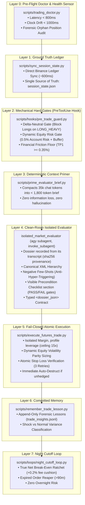

# Autonomous Trading Desk (ATD) ⚡🏛️

[](https://www.python.org/downloads/)
[](https://opensource.org/licenses/MIT)
[](https://www.binance.com)
[]()
[]()

> **Institutional-Grade Quantitative Agentic Trading Framework with Fail-Closed Mechanical Gates & Clean-Room Context Architecture.**

Autonomous Trading Desk (ATD) bridges the gap between frontier Artificial Intelligence agents and rigorous financial engineering. Unlike naive "AI trading bots" that prompt an LLM directly to predict prices, ATD implements a **deterministic 8-layer multi-agent harness** where code-level gates physically enforce risk limits, clean-room subagents evaluate opportunities in ephemeral isolation, and atomic order verification eliminates unhedged execution risk.

---

## 🖥️ Supported Execution Runtimes

ATD is built to operate across modern agentic runtimes without lock-in:

1. **Antigravity IDE / CLI Native (agy):** Full harness integration with deterministic lifecycle hooks configured via [`.agents/hooks.json`](.agents/hooks.json) (paths relative to `.agents/`, the hooks' working directory), the always-on rule [`.agents/rules/trading.md`](.agents/rules/trading.md) and the clean-room evaluator subagent [`.agents/agents/isolated_market_evaluator/agent.md`](.agents/agents/isolated_market_evaluator/agent.md). Launch agy from the repository root in a POSIX shell (Linux, macOS or WSL); native Windows agy runs hooks through `cmd /c` and is not supported. PreToolUse security gates intercept tool calls in `<15ms`.
2. **Claude Code:** Full harness parity via [`CLAUDE.md`](CLAUDE.md) (imports `AGENTS.md` and the always-on rules), [`.claude/settings.json`](.claude/settings.json) hooks (PreToolUse choke-point validation, PostToolUse ground-truth sync and PR-review trigger, Stop auto-review) and the evaluator, reviewer subagents and skills generated into `.claude/agents/` and `.claude/skills/` from the agy definitions. See [Running with Claude Code](#running-with-claude-code).
3. **Standalone CLI / Automated Scripts:** Every core engine (`scripts/trading_doctor.py`, `scripts/sync_session_state.py`, `scripts/execute_futures_trade.py`, `scripts/broad_market_radar.py`) runs deterministically from standard bash shells with identical fail-closed software gates.

---

## 🏗️ Architectural Topology (The 8 Layers)


```mermaid
graph TD
    subgraph L0 ["Layer 0: Pre-Flight Doctor & Health Sensor"]
        DOC["scripts/trading_doctor.py<br/>• Latency < 800ms<br/>• Clock Drift < 1000ms<br/>• Forensic Orphan Position Audit"]
    end

    subgraph L1 ["Layer 1: Ground Truth Ledger"]
        SYNC["scripts/sync_session_state.py<br/>• Direct Binance Ledger Sync (~600ms)<br/>• Single Source of Truth: session_state.json"]
    end

    subgraph L2 ["Layer 2: Mechanical Hard Gates (PreToolUse Hook)"]
        GATE["scripts/hooks/pre_trade_guard.py<br/>• Delta-Neutral Gate (Block Longs on LONG_HEAVY)<br/>• Dynamic Equity Risk Gate (0.5% Account Risk + Buffer)<br/>• Financial Friction Floor (TP1 >= 0.35%)"]
    end

    subgraph L3 ["Layer 3: Deterministic Context Primer"]
        BRIEF["scripts/prime_evaluator_brief.py<br/>• Compacts 35k chat tokens into &lt; 1,800 token brief<br/>• Zero information loss, zero hallucination"]
    end

    subgraph L4 ["Layer 4: Clean-Room Isolated Evaluator"]
        EVAL["isolated_market_evaluator (agy subagent, invoke_subagent)<br/>• Dossier recorded from its transcript (sha256 provenance)<br/>• Canonical XML Hierarchy<br/>• Negative Few-Shots (Anti-Hyper-Triggering)<br/>• Visible Precondition Checklist section (PASS/FAIL gates)<br/>• Typed &lt;dossier_json&gt; Contract"]
    end

    subgraph L5 ["Layer 5: Fail-Closed Atomic Execution"]
        EXEC["scripts/execute_futures_trade.py<br/>• Isolated Margin, profile leverage (ceiling 15x)<br/>• Dynamic Equity Volatility Parity Sizing<br/>• Atomic Stop Loss Verification (3 Retries)<br/>• Immediate Auto-Destruct if unhedged"]
    end

    subgraph L6 ["Layer 6: Committed Memory"]
        MEM["scripts/remember_trade_lesson.py<br/>• Append-Only Forensic Lessons (trade_insights.jsonl)<br/>• Shock vs Normal Variance Classification"]
    end

    subgraph L7 ["Layer 7: Night Cutoff Loop"]
        LOOP["scripts/loops/night_cutoff_loop.py<br/>• True Net Break-Even Ratchet (+0.2% fee cushion)<br/>• Expired Order Reaper (>90m)<br/>• Zero Overnight Risk"]
    end

    DOC --> SYNC --> GATE --> BRIEF --> EVAL --> EXEC --> MEM --> LOOP
```

---

## 💡 Core Engineering Principles

### 1. Deterministic Mechanical Hard Gates (PreToolUse Interception)
Natural language instructions are not a reliable safety barrier in live financial trading. ATD rejects the antipattern of relying on the LLM's stochastic memory to enforce risk boundaries. Instead, runtime **PreToolUse hooks physically intercept every order execution attempt at the OS level**:
- **Single Choke Point Enforcement:** Direct calls to exchange order tools are mechanically blocked. All orders must pass through `scripts/execute_futures_trade.py`; there is no MCP wrapper (calls to the retired `crypto_radar` MCP server are denied).
- **Mandatory Clean-Room Evaluation:** Orders require a non-expired (<20m) dossier in `logs/evaluations/latest_dossier.json`, recorded from the evaluator subagent transcript with `record_evaluation.py --from-subagent` and re-verified (sha256 provenance), approving the symbol and direction. Hand-written dossiers are rejected in PROD.
- **Delta-Neutral Gate:** If the portfolio marks `LONG_HEAVY`, attempts to execute a `LONG` order are rejected with `hard_gate_rejection: True` before any network packet reaches the exchange API. If `SHORT_HEAVY`, additional `SHORT` orders are blocked.
- **Dynamic Equity Risk Gate:** Maximum monetary loss is capped to the user's calibrated equity risk profile (default 0.5% of Account Equity + 1.25x buffer, e.g. ~$50 on $10k, $5 on $1k, $0.50 on $100), dynamically verified against live balance.
- **Financial Friction Floor:** Orders where distance to TP1 is less than 0.35% are physically blocked, ensuring taker fees and bid-ask spread never consume the statistical edge.
- **Leverage Ceiling Gate:** Absolute desk ceiling of 15x; standard positions use the profile's `leverage_standard`, YOLO moonshots `leverage_yolo` (Binance agentic sub-accounts are capped at 5x and the executor clamps automatically).

### 2. Clean-Room Context Isolation
Long conversational histories accumulate token baggage, emotional bias from past streaks, and prompt drift. ATD packs real-time exchange data into an ultra-dense brief (< 1,800 tokens) and spawns an ephemeral clean-room evaluator (`isolated_market_evaluator`) with:
* **Canonical XML Hierarchy:** `<identity_and_role>`, `<operational_rules>`, `<negative_constraints>`, `<deliberation_protocol>`, `<few_shot_examples>`, `<output_contract>`.
* **Negative Few-Shots:** Explicit exemplars training the agent when **NOT** to act (e.g. aborting Longs on Delta gates, rejecting low-volume "Fake Tier S" setups, suppressing redundant search calls).
* **Forced Deliberation Checklist:** A mandatory, visible `## Precondition Checklist` (delta gate, brief freshness, institutional volume, friction, macro and catalyst checks, each with the brief value and a PASS/FAIL result) published before the Master Dossier. No XML scratch tags: Claude rejects them.

### 3. Fail-Closed Atomic Execution
Placing an entry order without an active Stop Loss is unacceptable. ATD queries Binance algo orders (`/fapi/v1/openAlgoOrders`) with up to 3 progressive retries (~2.8s) to absorb Mainnet indexing latency. If the Stop Loss fails to index, **the bot immediately triggers auto-destruct and closes the position at market (`reduceOnly=true`)**, guaranteeing zero unhedged exposure.

---

## 📊 Dual-Engine Operational Alpha

ATD operates a complementary dual-engine framework:

```
┌────────────────────────────────────────────────────────────────────────┐
│                   DUAL-ENGINE OPERATIONAL DESK                         │
├──────────────────────────────────┬─────────────────────────────────────┤
│ MOTOR 1: Intraday Desk (15m/5m)  │ MOTOR 2: Stat-Arb & Yield Desk (1h) │
├──────────────────────────────────┼─────────────────────────────────────┤
│ • Momentum & Mean-Reversion      │ • Cointegrated Pairs Stat-Arb       │
│ • Volatility Parity Sizing       │ • Engle-Granger MacKinnon (2010)    │
│   (0.5% account equity risk)     │   Critical values (p < 0.05, 1000b) │
│ • Structural Trailing Stop 15m   │ • Hurwicz-Corrected Half-Life       │
│ • True Net Break-Even (+0.2%)    │   (3h <= H <= 72h)                  │
│ • Taleb Barbell YOLO Moonshot    │ • Dynamic Beta Hedging (Δ ≈ 0)      │
│   (Isolated, profile leverage,   │ • Cash & Carry Funding Harvest      │
│    Zero premature truncation)    │   (Hurdle Rate >= 25% APR)          │
│ • Session Cutoff / Zero Night    │ • Multi-day horizon with neutral    │
│   unhedged exposure              │   directional risk                  │
└──────────────────────────────────┴─────────────────────────────────────┘
```

---

## 🚀 Complete Quickstart (Safe Sandbox First)

Follow these steps to deploy a safe, clone-ready environment. **TESTNET (Sandbox)** is the default recommended mode for all new setups.

### Step 1: Clone & Install Dependencies
```bash
git clone <repo-url> <repo>
cd <repo>

python3 -m venv venv
source venv/bin/activate
pip install -r requirements.txt
```

### Step 2: Environment Setup (Safe Testnet Default)
Copy the safe sandbox configuration template to `.env`:
```bash
# Copy the Testnet sandbox configuration as your default .env
cp config/environments/testnet.env .env
# (Alternatively, copy from template: cp config/environments/testnet.env.example .env)
```

Edit `.env` to include your Binance Futures Testnet API credentials (obtain free testnet keys at [testnet.binancefuture.com](https://testnet.binancefuture.com)):
```ini
# Target execution environment: TESTNET (default sandbox)
BINANCE_API_ENV=TESTNET

# Binance Futures Testnet API Credentials
BINANCE_API_KEY=your_testnet_api_key_here
BINANCE_SECRET_KEY=your_testnet_secret_key_here
BINANCE_FUTURES_BASE_URL=https://testnet.binancefuture.com
```

For PROD, start from `config/environments/prod.env.example` and choose an authentication mode with `BINANCE_AUTH_MODE`:
- `MCP`: Binance Agentic MCP Gateway on an isolated agentic sub-account (no API keys). Binance caps sub-accounts at 5x leverage (error `-4421`); the executor clamps leverage automatically.
- `KEYS`: standard HMAC API keys. Use a futures-only key with withdrawals disabled and IP restriction.

### Step 3: Interactive Onboarding & Risk Calibration
Run the interactive profiler to configure your risk profile (`config/user_profile.json`):
```bash
python3 scripts/user_profile.py --setup
```
This configures:
- Risk percentage per trade (`risk_pct_equity`, default 0.5% of equity on Stop Loss).
- Maximum margin ratio ceiling (`max_margin_ratio`, default 30% per trade).
- Leverage (`leverage_standard`, `leverage_yolo`; desk ceiling 15x) and optional `yolo_margin_fixed`.
- Autonomous Tier S execution (`autonomous_execution_tier_s`, off by default).
- Maximum concurrent open positions (default: 3).
- Overnight handling mode (`ZERO_OVERNIGHT_RISK`).
- Taleb Barbell YOLO moonshot preference.

### Step 4: Run Pre-Flight System Diagnostic (Layer 0)
Verify network latency, clock drift, credentials, account balance, and ensure zero unhedged orphan positions exist on Binance:
```bash
python3 scripts/trading_doctor.py
```
Expected output:
```text
=================================================================
🩺 TRADING DOCTOR — PRE-FLIGHT SYSTEM DIAGNOSTIC
Target Environment: TESTNET
=================================================================
✅ [API KEYS] Credentials OK (TESTNET)
ℹ️  [SAFETY FLAG] Sandbox mode (Testnet). LIVE_TRADING_ARMED flag not required.
✅ [NETWORK] API latency: 142ms
✅ [CLOCK DRIFT] Clock synchronization OK (18ms)
✅ [BALANCE] Available Margin: 10,000.00 USDT
✅ [ORPHAN AUDIT] Clean ledger. 0 open positions.
=================================================================
🩺 SYSTEM HEALTH: OPTIMAL (0 critical failures, 0 warnings)
Ready for algorithmic execution.
=================================================================
```

### Step 5: Antigravity (agy) Harness Setup
1. Open a POSIX shell (Linux, macOS or WSL) and `cd <repo>`; launch agy from the repository root.
2. `.agents/hooks.json` runs `scripts/hooks/pre_trade_guard.py` (PreToolUse) and `scripts/hooks/post_trade_sync.py` (PostToolUse) with paths relative to `.agents/`. Do not commit absolute paths or machine-specific interpreters.
3. agy discovers the evaluator at `.agents/agents/isolated_market_evaluator/agent.md` and the PR reviewers at `.agents/agents/*_reviewer/agent.md`; no `define_subagent` step is needed.
4. Verify the guard is live: `python3 scripts/trading_doctor.py` must report the pre-trade guard OK (`logs/hook_heartbeat.json` refreshed this session). Without it, live orders are prohibited.

### Running with Claude Code
1. Launch `claude` from the repository root. `CLAUDE.md` imports `AGENTS.md` and `.agents/rules/*.md`; `.claude/settings.json` wires the same hooks as agy (`pre_trade_guard.py`, `post_trade_sync.py`, `post_pr_review_hook.py`, `pr_review_stop_hook.py --claude`).
2. Subagents (`isolated_market_evaluator`, `<domain>_reviewer`) and skills (`market-radar`, `trade-execution-planner`, `pr-review`) are generated from `.agents/` by `python3 scripts/dev/sync_claude_assets.py`; never edit `.claude/agents/` or `.claude/skills/` by hand (the test suite runs the generator with `--check`). Restart the session after adding or renaming a subagent.
3. Evaluation flow: `python3 scripts/prime_evaluator_brief.py` → Agent tool with `subagent_type: "isolated_market_evaluator"` → `python3 scripts/record_evaluation.py --from-claude-subagent <agentId>` → `scripts/execute_futures_trade.py`. The recorder only accepts transcripts whose `meta.json` says `agentType: "isolated_market_evaluator"`.
4. Windows: copy `.claude/settings.local.json.example` to `.claude/settings.local.json` and fill in `<WSL_DISTRO>` / `<REPO_PATH_IN_WSL>` so the hooks run with the WSL Python.

### Step 6: (Optional) Notion & Research Setup
To enable automated journaling and research newsletter ingestion:
1. Copy the user context template:
   ```bash
   cp config/user_context.json.example config/user_context.json
   ```
2. Follow [`docs/notion_setup_guide.md`](docs/notion_setup_guide.md) to link your Notion database (`Trading Journal - Futures`).
3. Add Gmail app credentials to `.env` if you wish to parse crypto research newsletters via `scripts/fetch_newsletters.py`.

---

## 🕹️ Everyday Operations

### 1. Synchronize Ledger Ground Truth (Layer 1)
Sync session state against Binance in ~600ms:
```bash
python3 scripts/sync_session_state.py
```

### 2. Screen Market & Prime Context (Layers 2 & 3)
Run concurrent radar across 80+ contracts with Order Flow, CVD, and Taker volume analysis. All scanners are read-only CLI scripts with machine-readable `--json` output, documented in the [`market-radar` skill](.agents/skills/market-radar/SKILL.md); they are the only screening path:
```bash
python3 scripts/broad_market_radar.py --json             # 80+ pair intraday screener
python3 scripts/broad_yolo_scanner.py --json             # memecoin / YOLO moonshot screener
python3 scripts/quant_risk_engine.py parity --json       # also: pairs, kelly
python3 scripts/fetch_newsletters.py --format json       # research newsletters & catalysts
python3 scripts/prime_evaluator_brief.py --json          # writes logs/primed_brief.json (add --out <path> for a copy)
```

Third-party Binance skills (under `.agents/skills/`) may be installed locally but are not part of the flow; agents must never use them to place orders, move funds or sign API requests.

### 3. Clean-Room Evaluation & Dossier Recording (Layer 4)
Every new trade goes through the evaluator subagent; the dossier is never written by hand:
1. `python3 scripts/prime_evaluator_brief.py`
2. In agy, `invoke_subagent` with `TypeName: "isolated_market_evaluator"`; wait for its Master Dossier message (it ends in one `<dossier_json>` block with `status` APPROVED / REJECTED / NEUTRAL).
3. Record it from the subagent transcript:
   ```bash
   python3 scripts/record_evaluation.py --from-subagent <conversationId>
   ```
   The recorder prints approved symbols, directions, `requires_user_confirmation` flags and the validity window (20 min from evaluation). Tier A/A+ candidates require explicit user confirmation.
4. Execute through `python3 scripts/execute_futures_trade.py` only (the single choke point).

In TESTNET, the legacy manual recorder (`--env testnet --symbols ... --directions ...`) remains available for experiments; it is refused in PROD.

### 4. Position Management & Guardian Loop
Open positions are managed through the same executor CLI (risk-reducing actions are always allowed by the hook):
```bash
python3 scripts/execute_futures_trade.py --positions --json                 # read-only snapshot
python3 scripts/execute_futures_trade.py --move-breakeven --symbol BTCUSDT  # ratchet SL to True Net Break-Even
python3 scripts/execute_futures_trade.py --close-position --symbol BTCUSDT  # reduce-only market close
python3 scripts/execute_futures_trade.py --audit-orphans                    # or --auto-heal
```

Structural trailing stops, dead-alpha checks and the orphan audit run in the background **position guardian** (`scripts/loops/position_guardian_loop.py`). It never opens positions; state lives in `logs/guardian_state.json`:
```bash
python3 scripts/loops/position_guardian_loop.py --once --dry-run --json   # report only
python3 scripts/loops/position_guardian_loop.py --once --env prod         # one protective cycle
python3 scripts/loops/position_guardian_loop.py --interval 300 --env prod # long-running
```

Schedule it outside the agent session, for example with cron (`crontab -e`):
```cron
*/5 * * * * cd /path/to/repo && python3 scripts/loops/position_guardian_loop.py --once --env prod >> logs/guardian.log 2>&1
```
or with a systemd user service:
```ini
# ~/.config/systemd/user/position-guardian.service
[Unit]
Description=Trading desk position guardian

[Service]
WorkingDirectory=/path/to/repo
ExecStart=/usr/bin/env python3 scripts/loops/position_guardian_loop.py --interval 300 --env prod
Restart=on-failure

[Install]
WantedBy=default.target
```
Enable it with `systemctl --user enable --now position-guardian.service`.

### 5. Migration from the `crypto_radar` MCP server
The `crypto_radar` MCP server (`scripts/radar_mcp_server.py`) has been retired. Scans are now CLI scripts (`--json`), execution and position management go through `scripts/execute_futures_trade.py`, and trailing / dead-alpha / orphan checks run in the position guardian loop. The pre-trade guard denies any remaining `crypto_radar` tool call. If you registered the server outside this repository, remove it:
1. **Antigravity (agy):** delete the `crypto_radar` entry from the global MCP config (`~/.gemini/config/mcp_config.json`) and restart agy.
2. **Claude Code:** `claude mcp remove crypto_radar -s local` (and `-s user` if you added it globally).
3. Optionally uninstall the MCP SDK (`pip uninstall mcp`); it is no longer a dependency.
4. Schedule the position guardian (see above) to replace the old trailing / dead-alpha MCP tools.

### 6. Automated GitHub Issue Reporting & Observability
If subagents, hooks, or loops encounter unexpected failures, unhandled exceptions, or infrastructure drift, the system directly invokes the native bash reporter (`report_issue.sh`). Agents always pass the structured flags so the issue arrives as a complete engineering report:
```bash
./scripts/report_issue.sh --title "broad_market_radar: ticker stream timeout" \
  --error "ReadTimeout at /fapi/v1/ticker/24hr after 3 retries" \
  --severity MEDIUM --category infra \
  --repro "python3 scripts/broad_market_radar.py --json (exit 1)" \
  --root-cause "No backoff on 5xx/timeouts in the ticker fetch" \
  --affected-files "scripts/broad_market_radar.py:40-75" \
  --context "Scan before the London open; BTC 15m data was fresh" \
  --output-file logs/radar_last_run.txt \
  --impact "Scan degraded: no candidates this cycle, no orders affected" \
  --acceptance-criteria "Exponential backoff on timeouts; regression test in tests/"

# If offline or gh is not authenticated, issues are safely queued in logs/issues_backlog.jsonl. Sync them with:
./scripts/report_issue.sh --sync
```
- **Body:** six sections (executive summary with severity/priority matrix, runtime & ledger telemetry, reproduction + raw output tail, code pointers & root cause, desk impact, remediation & acceptance checklist). Telemetry (`scripts/utils/issue_telemetry.py`) adds git commit/branch, environment, delta bias, open symbols and PnL *sign* only; free text is sanitized (tokens, keys, USD/USDT amounts). Without Python it degrades to bash-only telemetry.
- **Labels:** `agent-failure`, `severity:<level>`, `priority:<Px>`, `cat:<category>`. `--severity` is case-insensitive and validated (exit 2 on invalid values); `--priority` defaults from severity (CRITICAL→P0, HIGH→P1, MEDIUM→P2, LOW→P3). If the repository rejects the labels they are created (`gh label create --force`) and the create is retried; as a last resort the issue is created unlabelled with a `[SEV/Px] ` title prefix, the labels are added with `gh issue edit`, and a warning prints the exact fix-up command if that fails.
- **Executor failures:** the pre-trade hook classifies the whole command text, so an executor command inline in `--repro` / `--error` can get the report itself held behind the trade gate. When the failing command is `scripts/execute_futures_trade.py`, put the exact command and its output in a file and pass it with `--output-file` / `--context-file`; keep `--repro` to the script name and exit code.
- **Delivery:** only an HTTP 422 (rejected labels) triggers the label fallback; any other gh/curl failure (5xx, timeout, 403, network) queues the report in the backlog so no duplicate issues are created. `--sync` adds the default `priority:*` label to legacy entries queued with only `severity:*`. Values of monetary keys (`*_usdt`, `*pnl*`, `*margin*`, `*balance*`, ...) are redacted from all text and attached files.
- **Manual reports:** the GitHub issue forms (`.github/ISSUE_TEMPLATE/`: *Harness failure / bug*, *Enhancement*) require severity and priority; the `issue-triage` workflow labels any issue missing them `needs-triage`. `scripts/report_agent_issue.py` offers the same flags for Python callers.

### 7. PR Review with Native Subagents
Pull Requests are audited inside the same agy session by four isolated, read-only reviewer subagents (`.agents/agents/<domain>_reviewer/agent.md`: `trading_risk`, `binance_microstructure`, `agentic_harness`, `prompt_engineering`). Each starts with a clean context, can only `view_file` / `grep_search` / `list_dir` (`commandExecutionPolicy: "off"`) and returns one `### Verdict: <reviewer>` section with `send_message`.

* **Manual:** type `/pr-review` (optionally with the PR number). The [`pr-review` skill](.agents/skills/pr-review/SKILL.md) asks before posting the comment.
* **Automatic:** after a successful `gh pr create` or feature-branch push, the `pr-review-trigger` PostToolUse hook marks a review as pending (`logs/pr_review_state.json`) and the Stop hook (`scripts/hooks/pr_review_stop_hook.py`) keeps the session going with an instruction to run the skill, which then posts without asking. It stops prompting once the comment is posted, the agent closes it (`python3 scripts/ci/pr_review_state.py done --reason no_pr|declined`), or after 3 attempts.

Flow (all helpers are deterministic):
1. `python3 scripts/ci/triage_pr.py origin/main --context-dir logs/pr_review` maps changed files to the required reviewers (fail-closed: core or unclassified files trigger all four) and writes the diff, per-file patches and `index.md`.
2. One `invoke_subagent` call launches every required reviewer in parallel.
3. `python3 scripts/ci/assemble_review.py --pr <n> --from-subagent <reviewer>=<conversationId> ...` copies each verdict verbatim from the subagent transcript into `logs/pr_review/report.md` and computes the consolidated verdict.
4. `python3 scripts/ci/verify_review.py logs/pr_manifest.json logs/pr_review/report.md` (exit 0 approved, 1 changes required, 2 missing reviewers to re-invoke).
5. `gh pr comment <n> --body-file logs/pr_review/report.md`.

Headless fallback without an interactive agy session (e.g. CI with `GEMINI_API_KEY`): `python3 scripts/ci/run_pr_audit.py origin/main logs/pr_review/report.md` builds one prompt from the same agent definitions.

---

## 📂 Repository Structure

```
autonomous-trading-desk/
├── .agents/
│   ├── agents/
│   │   ├── isolated_market_evaluator/
│   │   │   └── agent.md               # Clean-room evaluator subagent (XML prompt, negative few-shots)
│   │   └── <domain>_reviewer/
│   │       └── agent.md               # Read-only PR reviewer subagents (4 domains)
│   ├── hooks.json                     # Antigravity PreToolUse/PostToolUse/Stop hooks (paths relative to .agents/)
│   ├── rules/
│   │   └── trading.md                 # Always-on safety invariants
│   ├── mcp_config.json                # Workspace MCP servers for agy (Notion, Binance gateway)
│   └── skills/
│       ├── market-radar/              # Read-only CLI scanners with --json output
│       ├── pr-review/                 # /pr-review: multi-agent PR review orchestration
│       └── trade-execution-planner/   # Core execution & market radar skill
│                                      # (third-party Binance skills may also live here; not part of the flow)
├── .claude/
│   ├── agents/                        # Claude Code subagents (generated from .agents/agents/)
│   ├── skills/                        # Claude Code skills (generated from .agents/skills/)
│   ├── settings.json                  # Claude Code PreToolUse/PostToolUse/Stop hooks
│   └── settings.local.json.example    # Windows: run the hooks through WSL (copy to settings.local.json)
├── CLAUDE.md                          # Claude Code entry point (imports AGENTS.md + rules)
├── config/
│   ├── environments/
│   │   ├── prod.env.example           # Production environment credentials template
│   │   ├── testnet.env                # Local Testnet configuration (safe sandbox default)
│   │   └── testnet.env.example        # Tracked Testnet sandbox template
│   ├── user_context.json.example      # NotebookLM, newsletter, and Notion context template
│   └── user_profile.json.example      # Risk appetite & dynamic profile template
├── docs/
│   ├── agent_prompt_engineering_guide.md # Definitive agent prompt manual
│   └── notion_setup_guide.md          # Step-by-step Notion Trading Journal integration guide
├── research/
│   ├── 01_kelly_criterion_crypto_risk.md
│   ├── 02_spot_cvd_order_flow_absorptions.md
│   ├── 03_stop_hunt_neutralization_atr_buffers.md
│   └── 04_funding_rate_arbitrage_and_liquidations.md
├── scripts/
│   ├── adapters/
│   │   └── exchange_adapter.py        # Exchange seam abstraction
│   ├── ci/
│   │   ├── triage_pr.py               # Deterministic PR triage & reviewer context
│   │   ├── assemble_review.py         # Builds the review report from reviewer transcripts
│   │   ├── verify_review.py           # Mechanical review completeness gate
│   │   ├── pr_review_state.py         # Pending auto-review marker
│   │   └── run_pr_audit.py            # Headless PR review fallback (agy -p / Gemini API)
│   ├── dev/
│   │   └── sync_claude_assets.py      # Generates .claude/agents + .claude/skills from .agents/ (--check)
│   ├── hooks/
│   │   ├── pre_trade_guard.py         # Mechanical hard gate hook (<15ms, fail-closed)
│   │   ├── post_trade_sync.py         # Auto ground-truth sync on fills
│   │   ├── post_pr_review_hook.py     # Arms the PR review after gh pr create / push
│   │   └── pr_review_stop_hook.py     # Stop hook: runs /pr-review in the same session
│   ├── loops/
│   │   ├── night_cutoff_loop.py       # Zero overnight risk manager & order reaper
│   │   └── position_guardian_loop.py  # Trailing stops, dead alpha & orphan audit (never opens positions)
│   ├── utils/
│   │   ├── atomic_writer.py           # POSIX atomic ledger persistence
│   │   ├── dossier_provenance.py      # Dossier extraction & provenance verification
│   │   ├── env_resolver.py            # Centralized environment resolver & security enforcer
│   │   └── issue_telemetry.py         # Issue reporter telemetry, labels & six-section body
│   ├── broad_market_radar.py          # Concurrent 80+ pair screener (15m/5m/1h)
│   ├── dynamic_exit_manager.py        # Chandelier ATR structural trailing stop
│   ├── execute_futures_trade.py       # Fail-closed order deployment engine & hard gates
│   ├── fetch_newsletters.py           # Gmail research email parser & catalyst detector
│   ├── funding_arbitrage.py           # Cash-and-carry & delta-neutral pairs
│   ├── market_regime.py               # Macro BTC regime classifier
│   ├── microstructure_engine.py       # CVD, taker ratios, tape imbalance
│   ├── prime_evaluator_brief.py       # Context packing engine (<1,800 tokens)
│   ├── quant_risk_engine.py           # MacKinnon 2010 cointegration & dynamic equity sizing
│   ├── record_evaluation.py           # Records the evaluator dossier (--from-subagent)
│   ├── remember_trade_lesson.py       # Append-only immutable memory
│   ├── report_agent_issue.py          # Python issue reporter module
│   ├── report_issue.sh                # Native bash issue reporter tool
│   ├── sync_notion_journal.py         # Notion Journal reconciler vs Binance ledger
│   ├── sync_session_state.py          # Real Binance ledger synchronization (~600ms)
│   ├── trading_doctor.py              # Pre-flight diagnostic & health sensor
│   ├── trading_drift_watchdog.py      # Dead alpha detector & telemetry watchdog
│   └── user_profile.py                # User profile & onboarding profiler
├── .env.example                       # Sanitized credentials template (Testnet default)
├── .gitignore                         # Zero-leak security exclusions
├── AGENTS.md                          # Standard Operating Procedure (SOP)
├── LICENSE                            # MIT License
└── requirements.txt                   # Quantitative & async dependencies
```

---

## 📖 In-Depth Documentation

* **[Operating SOP (AGENTS.md)](AGENTS.md):** The operational handbook defining execution phases, sizing mathematics, and night cutoff protocols.
* **[Agent Prompt Engineering Guide](docs/agent_prompt_engineering_guide.md):** 60 KB comprehensive guide covering XML tag scoping, BPE attention routing, negative few-shots, KV cache optimization (>90% hit rate), and a visible, plain-markdown precondition checklist for deliberation (no tagged scratch output).
* **[Notion Setup Guide](docs/notion_setup_guide.md):** Complete guide to configuring the Notion Trading Journal database schema and automated reconciliation.
* **[Research Notebooks](research/):** Deep-dive mathematical foundations on the Kelly Criterion, CVD order flow absorptions, ATR stop hunt neutralization, and funding arbitrage.

---

## 🛡️ Security & Fail-Closed Guarantee

1. **Zero Credential Commits:** Strictly enforced via exhaustive `.gitignore`.
2. **Atomic Dossier Verification:** The execution hook requires a fresh (<20 min) dossier in `logs/evaluations/latest_dossier.json` whose provenance (sha256 of the `<dossier_json>` block in the evaluator subagent transcript) is re-verified before allowing order dispatch.
3. **Environment Separation:**
   * **PROD:** All gates (Delta-Neutral, Dynamic Equity Risk, Transaction Fee Floor, Leverage Limit) are 100% rigid and inviolable. Zero exceptions.
   * **TESTNET:** Gates can be bypassed via explicit command flags (`--bypass-delta-gate`, `--bypass-eval-gate`) for stress testing and exploratory development.

---

## ⚖️ Disclaimer

*This software is for educational, research, and algorithmic experimentation purposes. Cryptocurrency futures trading involves substantial financial risk. The authors and contributors assume no responsibility for financial losses incurred through the deployment of this codebase.*

---

## 📄 License

Distributed under the **MIT License**. See [`LICENSE`](LICENSE) for details.
