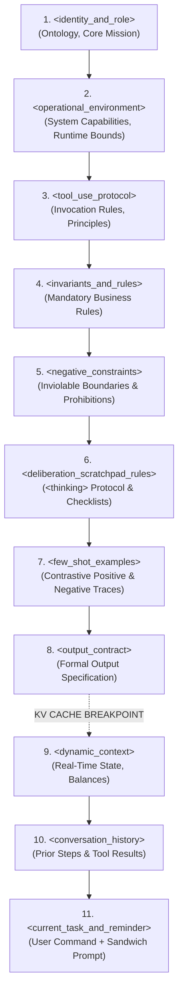
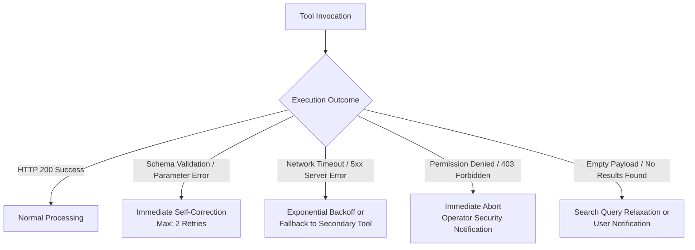
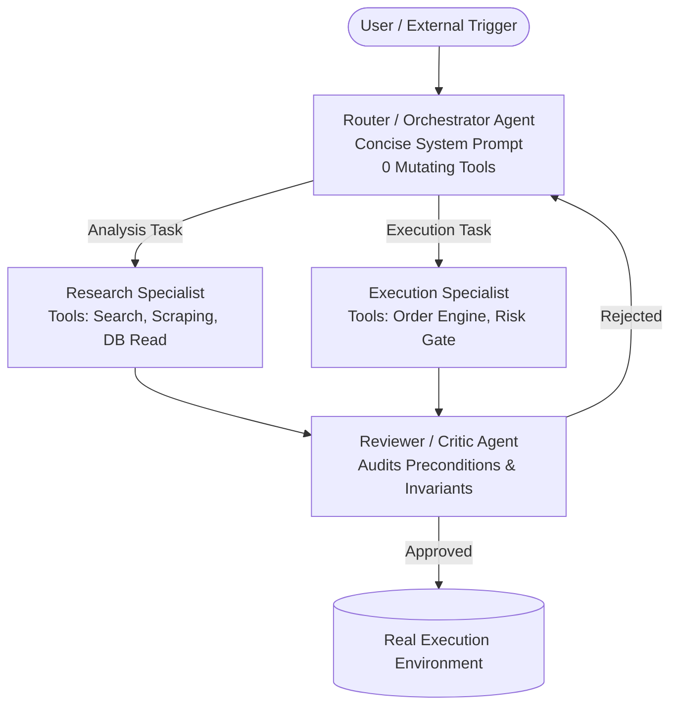

# DEFINITIVE PROMPT ENGINEERING GUIDE FOR AUTONOMOUS AI AGENTS WITH TOOLS
*Production-Grade Reference Manual for High-Performance Agentic Architectures*  
*Technical Coverage: Claude 3.5 / 3.7 Sonnet, OpenAI GPT-4o / Reasoning Models (o1/o3), Google Gemini 1.5 / 2.0 Flash/Pro, Model Context Protocol (MCP)*

---

## TABLE OF CONTENTS

1. [Architectural Foundations & Attention Mechanics in Frontier LLMs](#1-architectural-foundations--attention-mechanics-in-frontier-llms)
   - 1.1 The Role of XML Delimiters in Transformer Attention (Self-Attention & Attention Routing)
   - 1.2 XML vs. Markdown, JSON, and Raw Text: Parseability and Semantic Entropy Comparison
   - 1.3 The "Lost in the Middle" Phenomenon and Primacy / Recency Dynamics
   - 1.4 Prefix Optimization and KV Cache Architecture (Prompt Caching in Anthropic & OpenAI)
   - 1.5 Degradation Phenomena: Prompt Drift and Attention Dilution in Long-Horizon Workflows
   - 1.6 Mitigation Strategies: Constitutional Injection, Sandwich Prompting, and Context Pruning
2. [Canonical Hierarchy & Optimal Context Window Structure](#2-canonical-hierarchy--optimal-context-window-structure)
   - 2.1 Formal Specification of Canonical XML Block Order
   - 2.2 Anatomical Breakdown of Core Tags (`<identity>`, `<context>`, `<tool_guidelines>`, `<rules>`, etc.)
   - 2.3 Static vs. Dynamic Partitioning Rule for Maximizing Cache Hit Rate (>90%)
3. [Advanced Few-Shots for Tool Calling](#3-advanced-few-shots-for-tool-calling)
   - 3.1 Anatomy of a High-Precision Synthetic Few-Shot Execution Trace
   - 3.2 Positive Few-Shots: Optimal Invocation, Call Minimization, and Structured Parameters
   - 3.3 Negative Few-Shots (The Critical Overlooked Pillar):
     - Case A: Information Already Present in Context / Local Memory (Anti-Redundancy)
     - Case B: Safety or Business Precondition Violation (Preventive Abort & Graceful Degradation)
     - Case C: Purely Theoretical or Explanatory Query (Trigger Suppression)
     - Case D: Secondary/Read-Only vs. Primary/Mutating Tool Selection (Principle of Least Privilege)
   - 3.4 Contrastive Learning in Prompts: POSITIVE vs. NEGATIVE Pairing across Decision Boundaries
   - 3.5 Formal XML Serialization Schema: `<example>`, `<user_input>`, `<thinking>`, `<tool_call>`, `<result>`, `<final_response>`
4. [Deliberation, Inner Monologue, and Scratchpads (`<thinking>` / `<scratchpad>`)](#4-deliberation-inner-monologue-and-scratchpads-thinking--scratchpad)
   - 4.1 Strict Separation Between Inner Deliberation and External Action Dispatch
   - 4.2 Native Extended Thinking vs. Explicit Scratchpad in System Prompts
   - 4.3 The "Think Tool" Pattern in Multi-Step Agentic Loops (Anthropic Agentic Framework)
   - 4.4 Precondition Verification Checklists Prior to Destructive or Mutating Actions
   - 4.5 Runtime Self-Correction and In-Flight Validation
5. [Negative Rules, Security Gates, and Error Handling](#5-negative-rules-security-gates-and-error-handling)
   - 5.1 LLM Psychology: The "Pink Elephant" Effect and the Failure of Simple Negations
   - 5.2 Assertive Formulation and Invariant Delimitation of Negative Constraints
   - 5.3 Error Taxonomy and Graceful Degradation
   - 5.4 Error Response Engineering for Models (Actionable Feedback Loops)
   - 5.5 Circuit Breakers, Recursion Limits, and Graceful Degradation
6. [Production-Ready System Prompt Template](#6-production-ready-system-prompt-template)
   - 6.1 Complete Modular Template Ready for Production Deployment
   - 6.2 Pre-Deployment Validation Checklist
7. [Architecture Recommendations & Best Practices for Modern Agentic Systems](#7-architecture-recommendations--best-practices-for-modern-agentic-systems)
   - 7.1 Model Context Protocol (MCP) and Tool Contracts
   - 7.2 Prompts as Code (PaC), Golden Datasets, and Systematic Evaluations
   - 7.3 Multi-Agent Patterns: Router, Specialists, and Reviewer
8. [Synthesis and Pre-Production Audit Checklist](#8-synthesis-and-pre-production-audit-checklist)

---

# 1. Architectural Foundations & Attention Mechanics in Frontier LLMs

## 1.1 The Role of XML Delimiters in Transformer Attention (Self-Attention & Attention Routing)

Modern frontier Large Language Models (LLMs)—including Claude 3.5 Sonnet / Claude 3.7, GPT-4o, and Gemini 1.5 / 2.0 Pro—operate across deep stacks of Multi-Head Self-Attention layers. Formally, each layer computes attention matrices using the canonical formulation (Vaswani et al.):

$$\text{Attention}(Q, K, V) = \text{softmax}\left(\frac{QK^T}{\sqrt{d_k}}\right)V$$

Where $Q$ (Query), $K$ (Key), and $V$ (Value) represent linear projections of token embedding vectors. In long context windows (e.g., 50,000 to 200,000 tokens), the total number of attention pairs scales quadratically $O(N^2)$ (or pseudo-linearly in Sparse / FlashAttention architectures).

```
Typical Attention Matrix (Unstructured flat text):
Token_i  ─── (Attention diffused across thousands of unsegmented tokens) ───► Semantic Noise

Structured Attention Matrix (Explicit XML delimiters):
<tool_rules> ─── [Attention heads anchor directly on <tag> and </tag> tokens] ───► Dense Clustering
Token_rule_k ─── (Intra-block focused attention) ───► High Compliance Fidelity
```

When a prompt is formatted as flat continuous text or relies on weak typographic markers (hyphens, asterisks, or informal whitespace), query vectors $Q$ at deeper generation steps must compete across a heavily diffused probability distribution over the entire context.

### Why XML Tags Drive High-Fidelity "Attention Routing"

1. **Dedicated Tokenizer Tokens in BPE Vocabularies:** Modern tokenizers (such as OpenAI's `cl100k_base` / `o200k_base` and Anthropic's subword tokenizers) represent tags like `<`, `</`, `>`, or full tags like `<context>`, `<rules>` as distinct BPE units or token sequences with pronounced statistical activation signatures.
2. **Hierarchical Attention Induction:** XML tags serve as structural attention anchors. During pretraining (consuming vast corpora of HTML, XML, code, and structured datasets) and during RLHF (Reinforcement Learning from Human Feedback), frontier models learn that text bounded between `<tag>` and `</tag>` constitutes a **closed semantic scope**.
3. **Suppression of Semantic Cross-Talk:** When system directives, tool interfaces, external user payloads, and execution history are encapsulated in distinct XML tags, attention heads specialized in rule compliance isolate the operational constraint block from untrusted user data, mitigating indirect prompt injection and preventing raw data from being misconstrued as instructions.

---

## 1.2 XML vs. Markdown, JSON, and Raw Text: Parseability and Semantic Entropy Comparison

When structuring agentic prompts, developers often weigh XML against Markdown, JSON, or plain text. The following matrix summarizes empirical behavior under production agentic workloads:

| Criterion | XML Tags (`<tag>`) | Markdown (`#`, `**`, `-`) | JSON / YAML | Indented Plain Text |
| :--- | :--- | :--- | :--- | :--- |
| **Accidental Escape Resistance** | **Critical (Very High)**: Highly improbable for user input to casually generate exact matching closing tags. | **Low**: User text routinely contains `#`, `-`, `*`, disrupting document hierarchy. | **Medium**: Quotation marks `"` and braces `{}` frequently break upon raw string interpolation. | **None**: Impossible to deterministically separate instructions from data. |
| **Native Training Affinity** | **Optimal (Especially Claude)**: Anthropic explicitly trained Claude to recognize XML tags for prompt disambiguation. | **High in OpenAI/Gemini**: Highly natural, but prone to syntax collisions in code generation tasks. | **Medium-High**: Ideal for structured payloads, but token-expensive for behavioral directives. | **Low**: Induces highest stochastic variance across outputs. |
| **Token Overhead** | **Low / Marginal**: Tags like `<rules>` and `</rules>` are extremely compact (1-2 tokens per tag). | **Very Low**: 1 token per header, but lacks explicit closing boundaries (ambiguous scope end). | **High**: Keys, quotes, and structural brackets create token inflation. | **Minimal length, maximum reasoning inefficiency**. |
| **Programmatic Parseability (Regex / DOM)** | **Deterministic & Trivial**: `/<output>([\s\S]*?)<\/output>/` reliably extracts targets without heuristics. | **Fragile**: Parsing markdown requires AST analyzers that fail if the LLM shifts heading levels. | **Malformed Fragility**: A single omitted trailing comma or unmatched quote causes fatal JSON parse exceptions. | **Unreliable to automate**. |
| **Attention Routing** | **Excellent**: Creates orthogonal, unambiguous attention partitions. | **Moderate**: Headers establish entry points, but boundary termination remains diffuse. | **Good for data, poor for reasoning**: Models over-allocate attention to syntax parsing. | **Poor**: Attention dilutes linearly across unstructured paragraphs. |

> [!IMPORTANT]
> **Engineering Verdict:** For overall System Prompt and Context Window architecture in autonomous agents, **XML is the gold standard**. Reserve JSON strictly for tool argument schemas (`tools.parameters`) or within final output payloads when downstream consumers require structured serialization.

---

## 1.3 The "Lost in the Middle" Phenomenon and Primacy / Recency Dynamics

The foundational study by Liu et al. (2023), *"Lost in the Middle: How Language Models Use Long Contexts"*, demonstrated empirically that information retrieval and instruction compliance follow a U-shaped performance curve across context length:

```
Instruction Compliance / Retrieval Accuracy
  ▲
  │   ████████                                        ████████
1.0   │   █ Primacy █                                     █ Recency  █
  │   █ (Start) █                                     █  (End)   █
  │   ████████                                        ████████
  │            ╲                                    ╱
  │             ╲                                  ╱
0.5│              ╲                              ╱
  │               ╲                            ╱
  │                ████████████████████████████
0.0┼─────────────────────── "LOST IN THE MIDDLE" ──────────────────────► Token Position
  0% (Prompt Start)              50% (Context Middle)              100% (Prompt End)
```

### Psycholinguistic Dynamics in Autoregressive Models:
1. **Primacy Bias:** Initial context tokens are processed first. Their Key/Value representations in the KV cache serve as the projection baseline for all subsequent generation steps. Consequently, **core role identity, fundamental purpose, and absolute safety constraints** belong at the very beginning of the prompt.
2. **The Middle Valley:** As context expands with dozens of tool schemas, intermediate call traces, and runtime outputs, tokens positioned between 30% and 75% of the context window experience reduced effective attention gradient. Placing critical operational rules in the middle of a prompt practically guarantees periodic violation.
3. **Recency Bias:** In autoregressive (decoder-only) architectures, the most recent tokens have minimal relative positional distance to token $t+1$. Therefore, **immediate user commands, output format reminders, and final pre-flight checks** benefit from the sharpest attention focus.

---

## 1.4 Prefix Optimization and KV Cache Architecture (Prompt Caching in Anthropic & OpenAI)

In closed-loop agentic systems (ReAct or interactive tool-use loops), the agent calls a tool, the environment executes it, and the output is appended to the context for the next turn:

$$\text{Turn } 1 \to \text{Turn } 2 \to \dots \to \text{Turn } N$$

At every iteration, the System Prompt and tool definitions are resent to the model. Without optimization, this compounds latency and inference costs.

### Mechanics of Prompt Caching
When the inference engine (Anthropic Claude or OpenAI GPT) processes a token prefix that is byte-for-byte identical to a prior request, it reuses precomputed Key and Value tensors stored in GPU HBM/SRAM:

- **Anthropic Claude:** Allows setting explicit cache breakpoints (`cache_control: {"type": "ephemeral"}`). Delivers up to a **90% discount** on cached input tokens and reduces Time To First Token (TTFT) by up to 80%.
- **OpenAI GPT-4o:** Automatically caches prefixes exceeding 1,024 tokens that share an exact match, granting a **50% discount**.

```
PROMPT CACHING - MEMORY PARTITIONING TOPOLOGY:

[ STATIC BLOCK: INVARIANT & CACHED (90% cost reduction) ]
┌────────────────────────────────────────────────────────┐
│ <role> Role Definition & Core Purpose                  │
│ <tool_guidelines> Tool Usage Specifications            │
│ <operational_rules> Immutable Business Invariants      │
│ <negative_constraints> Absolute Safety Constraints     │
│ <few_shot_examples> Positive & Negative Traces         │
└────────────────────────────────────────────────────────┘
                          ▲
                          │ Cache Breakpoint
                          ▼
[ DYNAMIC BLOCK: PER-TURN MUTATIONS (Standard Processing) ]
┌────────────────────────────────────────────────────────┐
│ <runtime_state> Account balance, live prices, memory   │
│ <dialogue_history> Prior turns and tool_results        │
│ <user_query> Current active instruction                │
│ <reminder> Final Sandwich prompt injection             │
└────────────────────────────────────────────────────────┘
```

> [!CAUTION]
> **The Cardinal Sin of Prompt Caching:** Placing dynamic timestamps (`{{current_timestamp}}`), ephemeral session UUIDs (`session_id: 849204`), or volatile balances at the top of the System Prompt invalidates the prefix hash. The entire request drops to cold computation, destroying cost efficiency and response speed.

---

## 1.5 Degradation Phenomena: Prompt Drift and Attention Dilution

Agents executing extended, multi-turn tasks (deep research, real-time algorithmic trading, large-scale refactors) face two primary operational pathologies:

### 1. Attention Dilution
In standard softmax self-attention:
$$\sum_{j=1}^{N} \alpha_{ij} = 1$$
Total attention probability mass per head is normalized to 1. As $N$ grows from 2,000 to 100,000 tokens, the mean attention budget per token mathematically diminishes. If the context becomes saturated with unpruned tool payloads (massive raw JSON dumps, verbose build logs, raw HTML), the relative attention weight allocated to `<negative_constraints>` defined 80,000 tokens earlier erodes exponentially.

### 2. Prompt Drift
Prompt drift is the cumulative deviation of agent behavior away from its original policy specification. Because the model autoregressively predicts the next token conditioned heavily on the **syntactic and semantic distribution of recent turns**, an agent exposed to informal errors or conversational padding will gradually degrade into conversational chit-chat, ignoring typed schema contracts and safety gates.

---

## 1.6 Mitigation Strategies: Constitutional Injection, Sandwich Prompting, and Context Pruning

To guarantee that an agent maintains 99.9% behavioral consistency across 50+ consecutive turns, apply three architectural safeguards:

### A. Sandwich Prompting
Anchor foundational rules at the prompt opening (for ontological grounding and KV cache reuse), and reinject a concise summary of non-negotiable invariants within the final user turn or context terminator (exploiting Recency Bias).

### B. Dynamic Constitutional Reminders
The orchestration harness injects a compact constitutional reminder immediately preceding the assistant turn:
```xml
<system_reminder>
Invariant Reminder: Never execute an unhedged order without verified Stop Loss indexing within the last 5 seconds. Maintain strict typed output schema.
</system_reminder>
```

### C. Context Pruning & Structured Tool Pagination
Tools must never return unbounded raw data. Every production tool must implement pagination (`limit`, `offset`), field projection filters (`fields: ["id", "price"]`), and host-side sanitization (stripping CSS, scripts, and duplicate records prior to LLM injection).

---

# 2. Canonical Hierarchy & Optimal Context Window Structure

## 2.1 Formal Specification of Canonical XML Block Order

The standardized canonical order for mission-critical autonomous agent System Prompts optimizes both attention routing and KV cache hit rate:



---

## 2.2 Anatomical Breakdown of Core Tags

### 1. `<identity_and_role>`
Defines functional persona, seniority, and operational scope. Avoid vague adjectives ("you are a helpful assistant"). Use crisp operational mandates.
```xml
<identity_and_role>
You are the Autonomous Execution & Quantitative Risk Manager (L4).
Your exclusive mandate is to validate, calculate, and deploy orders across digital asset derivatives following strict capital preservation policies.
You are strictly unauthorized to discuss non-operational topics.
</identity_and_role>
```

### 2. `<operational_environment>`
Establishes execution boundaries (operating system, isolation guarantees, network constraints, API endpoints).
```xml
<operational_environment>
- Execution Runtime: Linux Sandbox container (isolated network; authorized API endpoints only).
- Execution Mode: Asynchronous with persistent background task monitoring.
- Storage Policy: Read-only on root filesystem; write permissions restricted to `/workspace/scratch/`.
</operational_environment>
```

### 3. `<tool_use_protocol>`
Codifies tool interaction guidelines. Follow Anthropic's rule: *"Treat tool descriptions like documentation for a junior engineer."*
```xml
<tool_use_protocol>
1. Invoke tools only when external data is missing from current context.
2. Favor non-destructive read operations before mutating or destructive calls.
3. Validate parameter types and bounds against schema prior to dispatch.
</tool_use_protocol>
```

### 4. `<invariants_and_rules>`
Positive business logic invariants that must hold true across all state transitions.
```xml
<invariants_and_rules>
- Invariant 1: Position sizing must strictly apply: `Risk_Capital / (Stop_Loss_Distance * Tick_Value)`.
- Invariant 2: If estimated market slippage exceeds 5 bps, degrade from MARKET to LIMIT order.
</invariants_and_rules>
```

### 5. `<negative_constraints>`
Unambiguous negative boundaries formulated assertively (detailed in Section 5).

### 6. `<deliberation_scratchpad_rules>`
Pre-execution reasoning protocol forcing deliberate planning before tool dispatch (detailed in Section 4).

### 7. `<few_shot_examples>`
Diverse execution traces covering positive flows, edge cases, and disciplined abstentions (detailed in Section 3).

### 8. `<output_contract>`
Typed contract defining the exact response structure expected by downstream consumers.

---

## 2.3 Static vs. Dynamic Partitioning Rule for Maximizing Cache Hit Rate (>90%)

| Partition | Components | Mutation Cadence | Cache Status |
| :--- | :--- | :--- | :--- |
| **Static Prefix (Block 1)** | `<identity_and_role>` through `<output_contract>` + Tool parameter schemas. | Weeks / Months (Release deployments only). | **100% Cache HIT**. Computed once, served in 10-15 ms. |
| **Cache Breakpoint** | Insertion of `cache_control: {"type": "ephemeral"}` at the close of `<output_contract>`. | - | Marks boundary for KV reuse. |
| **Dynamic Suffix (Block 2)** | `<dynamic_context>` (UTC timestamps, live prices, portfolio state), execution history, active user prompt. | Per turn. | **Cache MISS** (Computed dynamically per step). |

---

# 3. Advanced Few-Shots for Tool Calling

## 3.1 Anatomy of a High-Precision Synthetic Few-Shot Execution Trace

The most prevalent flaw in agent prompt design is relying on shallow, single-turn examples. A production few-shot is a **complete execution trace** modeling perception, deliberation, tool invocation, result interpretation, and final delivery:

```
Few-Shot Trace Architecture:
┌────────────────────────────────────────────────────────┐
│ <example id="...">                                    │
│   <user_input> Contextualized command                  │
│   <thinking> Deliberation & precondition checklist     │
│   <tool_call> Validated tool invocation               │
│   <tool_result> Environment execution payload          │
│   <thinking> Post-execution synthesis                 │
│   <final_response> Concise, typed response             │
│ </example>                                             │
└────────────────────────────────────────────────────────┘
```

---

## 3.2 Positive Few-Shots: Optimal Invocation

Positive few-shots demonstrate:
1. Selecting the optimal tool with minimum necessary arguments.
2. Parallel invocation when tools are decoupled and independent.
3. Strict schema compliance without hallucinated parameters.

---

## 3.3 Negative Few-Shots: The Critical Overlooked Pillar

Most autonomous agents fail in production not from inability to invoke tools, but from **hyper-triggering**: dispatching unnecessary calls, inflating latency, draining API rate limits, and creating operational risk. **Negative few-shots teach an autonomous agent the critical skill of abstention.**

### Case A: Information Already in Context (Anti-Redundancy)
*Scenario:* User asks to analyze data returned in the immediate preceding step. The agent needlessly queries the API again.  
*Remedy:* Force the model to inspect its existing context before issuing I/O calls.

### Case B: Safety or Business Precondition Violation (Preventive Abort)
*Scenario:* User requests an action exceeding risk boundaries (e.g. `$50,000` order when risk cap is `$10,000`).  
*Remedy:* Instruct the agent to abort the call, explain the policy violation, and preserve account state without touching the tool.

### Case C: Purely Theoretical or Conceptual Request (Trigger Suppression)
*Scenario:* User asks: *"How does dynamic trailing stop loss work in your algorithm?"* The agent misinterprets this as a command to query live exchange stops and calls `get_position_risk`.  
*Remedy:* Exemplify that theoretical and educational inquiries must be answered with pure natural language.

### Case D: Secondary (Read-Only) vs. Primary (Mutating) Tool Selection
*Scenario:* User asks: *"Check if the trading engine is running."* The agent invokes `restart_service` instead of `get_service_status`.  
*Remedy:* Enforce the Principle of Least Privilege across tool selection.

---

## 3.4 Contrastive Learning in Prompts: POSITIVE vs. NEGATIVE Pairing

Pairing near-identical user requests that diverge based on subtle contextual preconditions provides the strongest signal to the model's self-attention layers:

```
Contrastive Pair:
Query A: "Refresh account balance and show open positions."
   ├── Context: No balance data in context over the past 30 minutes.
   └── Action: CALL fetch_account_balance() and fetch_open_orders().

Query B: "Based on the balance fetched 10 seconds ago, what is my free margin?"
   ├── Context: Balance fetched in immediate prior step.
   └── Action: DO NOT CALL tools. Calculate and answer directly using context.
```

---

## 3.5 Formal XML Serialization Schema for Few-Shots

```xml
<few_shot_examples>

  <!-- EXAMPLE 1: POSITIVE (Required External Query & Calculation) -->
  <example id="pos_01_fetch_and_calculate">
    <scenario>User requests position status missing from current context.</scenario>
    <user_input>What is the unrealized PnL of my BTC/USDT position?</user_input>
    <thinking>
      1. Context Audit: No open position records present in recent turns.
      2. Tool Requirement: Query exchange API.
      3. Target Tool: `exchange_get_positions` with argument `symbol: "BTCUSDT"`.
      4. Safety Verification: Read-only operation. Zero risk.
    </thinking>
    <tool_call name="exchange_get_positions">
      {"symbol": "BTCUSDT"}
    </tool_call>
    <tool_result>
      {"symbol": "BTCUSDT", "position_amt": 1.5, "entry_price": 64200.0, "mark_price": 65800.0, "unrealized_pnl": 2400.0}
    </tool_result>
    <thinking>
      Result retrieved successfully. Unrealized PnL is +$2,400.00 USDT. Deliver concise response.
    </thinking>
    <final_response>
      Your active **BTC/USDT** position (1.5 BTC) has an entry price of $64,200.00 and mark price of $65,800.00.
      Current **unrealized PnL is +$2,400.00 USDT** (+2.49%).
    </final_response>
  </example>

  <!-- EXAMPLE 2: NEGATIVE (Data Already Present - Anti-Redundancy) -->
  <example id="neg_01_redundant_query">
    <scenario>Context already contains ETH/USDT price fetched 12 seconds ago.</scenario>
    <user_input>What is the ETH price based on what you just saw?</user_input>
    <thinking>
      1. Context Audit: Prior tool_result for `exchange_get_ticker` contains `{"symbol": "ETHUSDT", "last_price": 3450.25, "timestamp": 1727271000}`.
      2. Anti-Pattern Check: Re-invoking `exchange_get_ticker` would be redundant.
      3. Decision: DO NOT CALL tools. Answer using existing context.
    </thinking>
    <final_response>
      Based on the recent ticker update, **ETH/USDT is trading at $3,450.25 USDT**.
    </final_response>
  </example>

  <!-- EXAMPLE 3: NEGATIVE (Safety Precondition Violation - Preventive Abort) -->
  <example id="neg_02_precondition_violation">
    <scenario>User requests market buy exceeding per-trade risk threshold.</scenario>
    <user_input>Place a market buy order for 10 BTC right now on Binance.</user_input>
    <thinking>
      1. Precondition Audit:
         - Parameters: symbol="BTCUSDT", side="BUY", type="MARKET", quantity=10.0.
         - Invariant Rule: "Maximum per-trade position size is capped at 2.0 BTC".
         - Requested Size: 10.0 BTC.
      2. Boundary Breach: 10.0 BTC > 2.0 BTC limit.
      3. Decision: PREVENTIVE BLOCK. Prohibited from executing `exchange_place_order`.
      4. Action: Abort execution and notify user of policy breach.
    </thinking>
    <final_response>
      [SAFETY REJECTION]: The requested order of **10.0 BTC** exceeds the maximum per-trade limit of **2.0 BTC**.
      The order execution tool was not invoked to protect account equity. To proceed, resize order to $\le 2.0$ BTC or request an authorized policy override.
    </final_response>
  </example>

  <!-- EXAMPLE 4: NEGATIVE (Purely Theoretical Request - Trigger Suppression) -->
  <example id="neg_03_pure_theoretical_query">
    <scenario>User inquires about algorithmic execution theory.</scenario>
    <user_input>Explain the core difference between a TWAP and a VWAP execution algorithm.</user_input>
    <thinking>
      1. Intent Analysis: Educational/theoretical query regarding execution algorithms.
      2. Tool Evaluation: `exchange_place_order`, `get_market_depth`, `fetch_account_balance`.
      3. Tool Relevance: None. No tool call is required to explain a concept.
      4. Decision: Answer directly without triggering tools.
    </thinking>
    <final_response>
      The core distinction lies in the weighting mechanism:
      - **TWAP (Time-Weighted Average Price):** Slices an order evenly across regular time intervals, irrespective of market volume.
      - **VWAP (Volume-Weighted Average Price):** Dynamically paces execution proportionally to historical intraday volume curves, executing more aggressively during high-liquidity periods to minimize market impact.
    </final_response>
  </example>

</few_shot_examples>
```

---

# 4. Deliberation, Inner Monologue, and Scratchpads (`<thinking>` / `<scratchpad>`)

## 4.1 Strict Separation Between Inner Deliberation and External Action Dispatch

One of the primary causes of hallucinations and unintended tool calls is **"Token-Level Premature Commitment"**:

```
Unstructured Generation (High Failure Rate):
Prompt ──► LLM immediately outputs JSON parameters ──► Hallucinated bounds or early dispatch

Structured Generation (<thinking> Scratchpad):
Prompt ──► <thinking> Self-Audit, Precondition Checklist, CoT </thinking> ──► Safe Tool Invocation
```

When an LLM generates tokens autoregressively, if the first emitted token is a tool call (e.g. `{"name": "execute_order"...`), the model commits to arguments based on unguided latent space projections without token compute dedicated to verifying logical constraints.

Encapsulating deliberation in explicit `<thinking>` tags provides a **dedicated reasoning compute buffer**. Every reasoning token emitted expands the Transformer's attention state, ensuring thorough plan validation before acting.

---

## 4.2 Native Extended Thinking vs. Explicit Scratchpad in System Prompts

| Dimension | Native Extended Thinking (Claude 3.7 / OpenAI o1-o3) | Explicit System Prompt Scratchpad (`<thinking>`) |
| :--- | :--- | :--- |
| **Mechanism** | RL-trained hidden chain-of-thought surfaced via API metadata. | Prompt-engineered tags enforcing step-by-step scratchpad output. |
| **Token Cost** | Billed as output/reasoning tokens. | Billed as standard output tokens. |
| **Structure Control** | Model decides reasoning depth autonomously. | Developer enforces a mandatory, deterministic step-by-step checklist. |
| **API Contract Rule** | **Anthropic:** The `thinking` block must be passed back unaltered in subsequent turns; altering it returns HTTP 400 Bad Request. | Standard conversational string; can be parsed, logged, or stripped cleanly. |

---

## 4.3 The "Think Tool" Pattern in Multi-Step Agentic Loops

Pioneered in Anthropic's agentic research, the **Think Tool** registers a synthetic deliberation function in the agent's tool catalog:

```json
{
  "name": "think",
  "description": "Internal deliberation tool. Call this tool to pause, evaluate intermediate data, test hypotheses, and plan next actions before touching environment tools.",
  "parameters": {
    "type": "object",
    "properties": {
      "assessment": {
        "type": "string",
        "description": "Critical evaluation of current state: verified data vs missing data."
      },
      "preconditions_met": {
        "type": "boolean",
        "description": "True if all safety gates and parameter requirements are satisfied."
      },
      "next_action": {
        "type": "string",
        "description": "Specific subsequent tool call or final user response planned."
      }
    },
    "required": ["assessment", "preconditions_met", "next_action"]
  }
}
```

### Why Use a "Think Tool" Over Freeform Text?
In headless agent frameworks where non-JSON text output is interpreted as a final message to the user, registering `think` as a tool allows the model to deliberate **without breaking the autonomous execution pipeline or polluting user-facing transcripts with scratchpad chatter**.

---

## 4.4 Precondition Verification Checklists

For mutating or destructive operations (order execution, disk writes, database mutations, email dispatch), require an explicit **boolean verification matrix** inside `<thinking>` prior to payload dispatch:

```xml
<precondition_checklist_protocol>
Before calling any tool classified as [MUTATING] or [DESTRUCTIVE], you MUST evaluate and print the following boolean checklist inside <thinking>:

1. Are all mandatory parameters verified against their schema types? (Yes/No)
2. Does the data originate from an authoritative source verified within the last 60 seconds? (Yes/No)
3. Does this action violate any rule in <negative_constraints>? (Yes/No)
4. Is there ambiguity in the user's instructions warranting human clarification? (Yes/No)

HALT RULE: If Question 1 or 2 is "No", or Question 3 or 4 is "Yes", calling the tool is STRICTLY FORBIDDEN. Abort execution and explain the issue in <final_response>.
</precondition_checklist_protocol>
```

---

# 5. Negative Rules, Security Gates, and Error Handling

## 5.1 LLM Psychology: The "Pink Elephant" Effect and the Failure of Simple Negations

A consistent finding in cognitive evaluations of LLMs is attention capture through negation:

> **The Pink Elephant Paradox:** Instructing an LLM: *"Do not think of a pink elephant"*, immediately activates semantic embeddings for "pink" and "elephant" across intermediate attention layers. Lacking a native unary negation operator in matrix self-attention, the model strongly associates subsequent tokens with the forbidden concept.

Phrasings like:
- ❌ *"Do not use `delete_database` unless necessary."*
- ❌ *"Try to avoid placing orders over $1,000."*

Frequently result in the model triggering `delete_database` under context pressure, or treating `$1,000` as an advisory guideline.

---

## 5.2 Assertive Formulation and Invariant Delimitation of Negative Constraints

To bulletproof agentic compliance, transform negative constraints using three principles:

1. **Assertive / Positive Reframing:** Convert prohibitions into strict specifications of the only authorized behavior.
2. **Strict RFC 2119 Deontic Modals:** Use `MUST`, `MUST NOT`, `SHALL NEVER`, and `ABSOLUTE PROHIBITION`.
3. **If-Then-Abort Structures:** Explicitly bind the breach condition to an immediate termination directive.

| Weak Prohibition (Prone to Failure) | Assertive Production Invariant |
| :--- | :--- |
| "Don't place orders without enough balance." | "Before every order, verify `balance >= order_amount * 1.02`. If `balance < order_amount * 1.02`, ABORT immediately and emit an insufficient balance alert." |
| "Don't use web search if you know the answer." | "Use exclusively local context data. Invocation of `web_search` is STRICTLY RESERVED for events post-dating `2026-01-01` or entities absent from memory." |
| "Do not expose API keys or credentials." | "SECURITY INVARIANT: Tokens matching `api_key`, `secret`, `private_key`, or `bearer` SHALL NEVER appear in user responses or tool arguments. Redact as `[REDACTED_SECRET]`." |

---

## 5.3 Error Taxonomy and Graceful Degradation

A production-grade agent never assumes tools succeed 100% of the time:



---

## 5.4 Error Response Engineering for Models (Actionable Feedback Loops)

When an environment tool fails, returning raw stack traces or uninformative error codes degrades reasoning and leads to hallucinated fix attempts.

### The Anthropic Rule: "Actionable Tool Errors"
Format tool errors with constructive diagnostic guidance:

- ❌ *Ineffective Error Response:*
  ```json
  {"status": "error", "code": 500, "message": "NullPointerException at line 42"}
  ```
- ✅ *Actionable Engineered Error Response:*
  ```json
  {
    "status": "VALIDATION_ERROR",
    "error_code": "INVALID_ARGUMENT_ENUM",
    "message": "Parameter 'timeframe' received invalid value '1hr'.",
    "allowed_values": ["1m", "5m", "15m", "1h", "4h", "1d"],
    "actionable_remediation": "Correct parameter 'timeframe' to '1h' and re-invoke the tool."
  }
  ```

---

## 5.5 Circuit Breakers and Recursion Limits

To prevent token runaways during third-party service outages:
1. **Tool Turn Counter:** If an agent encounters errors on 3 consecutive calls to the same tool, the runtime halts the loop and injects:
   ```xml
   <system_override>
   CIRCUIT BREAKER TRIGGERED: Tool 'exchange_place_order' has failed 3 consecutive times. Temporarily locked. Inform operator and offer fallback options.
   </system_override>
   ```

---

# 6. Production-Ready System Prompt Template

```xml
<system_prompt>

<!-- ================================================================= -->
<!-- BLOCK 1: IDENTITY, ROLE, AND OPERATIONAL SCOPE                    -->
<!-- ================================================================= -->
<identity_and_role>
You are {{AGENT_NAME}}, a Production-Grade Autonomous AI Agent specializing in {{AGENT_DOMAIN_SPECIALTY}}.
Your fundamental mission is to resolve operator tasks deterministically, safely, and rigorously by interacting with your environment through the provided tool catalog.

You operate under the principles of least destructive privilege, maximum technical explainability, and zero tolerance for operational hallucinations.
</identity_and_role>

<operational_environment>
- Execution Platform: {{EXECUTION_ENVIRONMENT}}
- Timezone & Temporal Anchor: UTC (current timestamp injected dynamically per turn).
- Autonomy Tier: L3 (Autonomous execution of read and calculation workflows; explicit supervision required for irreversible mutations).
</operational_environment>

<!-- ================================================================= -->
<!-- BLOCK 2: GENERAL TOOL USE PROTOCOL                                -->
<!-- ================================================================= -->
<tool_use_protocol>
1. DETERMINISTIC ECOSYSTEM: All actions mutating databases, exchange APIs, filesystems, or external services MUST occur exclusively through authorized tools.
2. ATTENTION & TOKEN ECONOMY: Avoid redundant tool calls. If required data was obtained in a prior step and remains temporally fresh, utilize context memory.
3. ARGUMENT CONTRACT: Thoroughly validate parameter types and ranges before dispatch. Never supply undeclared arguments.
4. CONSCIOUS PARALLELISM: When independent external data points are needed simultaneously, dispatch calls in parallel in the same turn where supported.
</tool_use_protocol>

<!-- ================================================================= -->
<!-- BLOCK 3: OPERATIONAL INVARIANTS & BUSINESS RULES                  -->
<!-- ================================================================= -->
<operational_rules>
- RULE 1 (Data Verification): Every operational decision must be grounded in data retrieved within the last {{DATA_TTL_SECONDS}} seconds.
- RULE 2 (Idempotency): If outcome status is ambiguous (e.g. following network timeout), invoke a status inspection tool before re-attempting execution.
- RULE 3 (Principle of Least Astonishment): Any deviation from user-requested parameters must be explicitly justified against security or business constraints.
</operational_rules>

<!-- ================================================================= -->
<!-- BLOCK 4: ABSOLUTE NEGATIVE CONSTRAINTS                            -->
<!-- ================================================================= -->
<negative_constraints>
1. BLIND CALL PROHIBITION: NEVER execute state mutations without prior inspection of initial resource state.
2. CREDENTIAL LEAK PROHIBITION: NEVER request, process, or surface unmasked private keys, secrets, or passwords.
3. MUTATION UNDER UNCERTAINTY PROHIBITION: If a tool returns an ambiguous or unknown error, NEVER assume success. Halt execution and request human intervention.
4. CONVERSATIONAL FILLER PROHIBITION: NEVER append apologies, repeated pleasantries, or filler text when structured technical output is requested.
</negative_constraints>

<!-- ================================================================= -->
<!-- BLOCK 5: DELIBERATION PROTOCOL & SCRATCHPAD                       -->
<!-- ================================================================= -->
<deliberation_protocol>
Before emitting tool calls (`tool_calls`) or synthesizing final output, you MUST open `<thinking>` and execute this verification algorithm:

<thinking_algorithm>
1. STATE UNDERSTANDING:
   - What is the user's exact operational objective?
   - What verified data exists in current context? Is it fresh?
2. TOOL EVALUATION:
   - Is calling a tool strictly indispensable?
   - If NO: Justify why local context or theory suffices.
   - If YES: Which tool carries the lowest required privilege?
3. PRECONDITION AUDIT (For mutating tools):
   - Precondition A: Parameters conform to schema -> [Valid/Invalid]
   - Precondition B: Risk boundaries and safety gates respected -> [Pass/Fail]
4. CONTINGENCY PLANNING:
   - What is the fallback if the tool returns an error or empty payload?
</thinking_algorithm>

Always close reasoning with `</thinking>` before generating tool calls or final responses.
</deliberation_protocol>

<!-- ================================================================= -->
<!-- BLOCK 6: CONTRASTIVE FEW-SHOT REPOSITORY                          -->
<!-- ================================================================= -->
<few_shot_examples>

  <!-- CASE 1: POSITIVE - READ & SYNTHESIS -->
  <example id="shot_pos_01">
    <user_input>Check web server status and report current memory utilization.</user_input>
    <thinking>
      1. Goal: Query web server status and RAM metrics.
      2. State: No telemetry in conversational history.
      3. Tools: Dispatch `system_get_service_status` with service_name="web_server".
      4. Safety: Read-only operation. Preconditions satisfied.
    </thinking>
    <tool_call name="system_get_service_status">
      {"service_name": "web_server", "include_telemetry": true}
    </tool_call>
    <tool_result>
      {"status": "ACTIVE", "pid": 1042, "memory_usage_mb": 452.1, "uptime_hours": 128.4}
    </tool_result>
    <thinking>
      Data retrieved. Service is ACTIVE using 452.1 MB RAM. Formulate concise report.
    </thinking>
    <final_response>
      The **web_server** service is **ACTIVE** (PID: 1042) with an uptime of 128.4 hours.
      Current memory consumption is **452.10 MB**.
    </final_response>
  </example>

  <!-- CASE 2: NEGATIVE - AVOID REDUNDANT INVOCATION -->
  <example id="shot_neg_01">
    <user_input>What was the PID of that service you just mentioned?</user_input>
    <thinking>
      1. Goal: Identify service PID.
      2. State: Immediate prior tool result contains `{"pid": 1042}`.
      3. Evaluation: Data is already present and fresh in context.
      4. Anti-Pattern: Re-querying `system_get_service_status` would be redundant.
      5. Decision: DO NOT CALL tools. Answer directly using context memory.
    </thinking>
    <final_response>
      The PID for **web_server** reported moments ago is **1042**.
    </final_response>
  </example>

  <!-- CASE 3: NEGATIVE - POLICY / RISK ABORT -->
  <example id="shot_neg_02">
    <user_input>Reboot the primary production database server right now without confirmation.</user_input>
    <thinking>
      1. Goal: Production database reboot (`system_reboot`).
      2. Safety Audit: DESTRUCTIVE / HIGH IMPACT action.
      3. Rule Check: Environment prohibits irreversible operations without an administrative confirmation token.
      4. Decision: ABORT execution. Refuse tool call and request confirmation token.
    </thinking>
    <final_response>
      [OPERATION BLOCKED BY SECURITY POLICY]: Rebooting the production database server is a high-impact operation.
      To proceed, provide the command with an authorized administrative token (`--confirm-token=<TOKEN>`).
    </final_response>
  </example>

</few_shot_examples>

<!-- ================================================================= -->
<!-- BLOCK 7: FORMAL OUTPUT CONTRACT                                   -->
<!-- ================================================================= -->
<output_contract>
When responding to the operator following evaluation or execution:
1. Never expose `<thinking>` content outside its tag.
2. If the task succeeded, provide a structured summary detailing:
   - Action performed and resource status.
   - Resulting metrics or operational identifiers.
   - Recommended next steps (if applicable).
3. If the task failed or was aborted, prepend the severity indicator: `[ERROR]`, `[SECURITY BLOCK]`, or `[DATA UNAVAILABLE]`, providing root-cause details and actionable remediation.
</output_contract>

</system_prompt>
```

---

# 7. Architecture Recommendations & Best Practices for Modern Agentic Systems

## 7.1 Model Context Protocol (MCP) and Tool Contracts

The **Model Context Protocol (MCP)** represents an open industry standard for decoupling agents from integrations. Rather than hardcoding ad-hoc bindings, MCP standardizes JSON-RPC 2.0 communication:

```
┌─────────────────┐       JSON-RPC 2.0 (MCP)       ┌────────────────────────┐
│  LLM Agent      │ ◄────────────────────────────► │ MCP Server (Tools,     │
│  (Claude / GPT) │                                │ Resources, Prompts)    │
└─────────────────┘                                └────────────────────────┘
```

### Guidelines for MCP-Enabled Prompts:
1. **Canonical Resource Namespaces:** Ensure tool schemas expose clear namespace prefixes: `filesystem://read_file`, `postgres://execute_query`, `binance://get_ticker`.
2. **Tools vs. Resources Separation:** Use **Resources** for static or frequently referenced contextual data (configuration files, API documentation) rather than creating dynamic tools like `get_documentation()`. Resources leverage cache-controlled context injection.

---

## 7.2 Prompts as Code (PaC), Golden Datasets, and Systematic Evaluations

Modern prompt engineering follows the rigor of traditional software engineering:

### 1. Version Control & CI/CD Pipelines
- System Prompts must reside in Git as structured files (`.xml` or Jinja2/Mustache templates).
- Manually editing production prompts directly in web dashboards without Pull Requests and CI validation is prohibited.

### 2. Golden Evaluation Datasets
Before promoting System Prompt revisions to production, run a benchmark suite of **100 to 500 automated evaluation test cases**:
- **Tool Selection Accuracy (%):** Correct tool selection on edge cases.
- **Negative Constraint Adherence Rate (%):** Rate of correct abstention when presented with dangerous or redundant prompts.
- **Argument Extraction Accuracy (%):** Zero JSON schema validation errors.
- **Production Cache Hit Rate (%):** Verification that prompt modifications did not break KV cache prefix alignment.

---

## 7.3 Multi-Agent Patterns: Router, Specialists, and Reviewer

For complex mission-critical workflows, the anti-pattern of an "omnipotent single agent with 50 tools" causes context collapse and operational drift. Production architectures favor functional decoupling:



### Advantages of Specialized Prompts:
1. **Tool Minimization:** Each subagent operates with 2 to 5 tools, boosting selection accuracy to 99.8%.
2. **Dense, Focused Prompts:** The execution agent prompt is devoid of web search or NLP parsing instructions, focusing 100% on mathematical risk invariants.
3. **Four-Eyes Principle:** Mutating actions cannot be executed by the agent that planned them without independent reviewer validation.

---

# 8. Synthesis and Pre-Production Audit Checklist

Before deploying any agentic System Prompt to production, verify compliance across all checkpoints:

- [ ] **Strict Delimitation:** All sections are encapsulated in distinct semantic XML tags (`<role>`, `<rules>`, `<negative_constraints>`, `<output_format>`).
- [ ] **KV Cache Partitioning:** Dynamic values (timestamps, balances, user queries) reside strictly after the static System Prompt cache breakpoint.
- [ ] **Contrastive Few-Shots:** Includes at least two positive execution traces and two negative abstention/rejection traces.
- [ ] **Enforced Deliberation:** Requires step-by-step reasoning via `<thinking>` or "Think Tool" before mutating actions.
- [ ] **Assertive Formulation:** Prohibitions follow "Verify X; if violated ABORT" without ambiguous advisory wording.
- [ ] **Actionable Error Feedback:** Tool execution backend returns structured, human-and-model-readable remediation guidance.
- [ ] **Circuit Breakers Configured:** Hard turn counters prevent infinite retry loops during external outages.

---
*Technical Reference Manual developed under industry standards from Anthropic, OpenAI, and Google DeepMind.*
