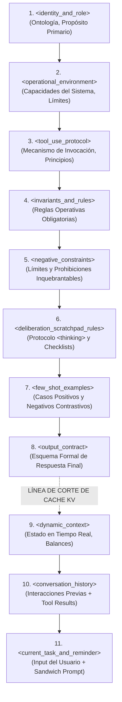
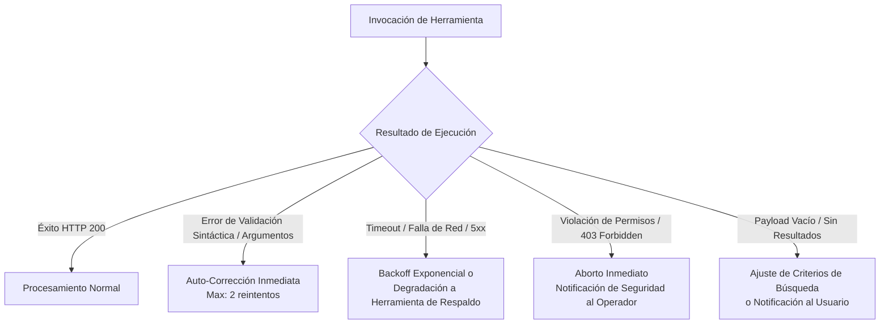
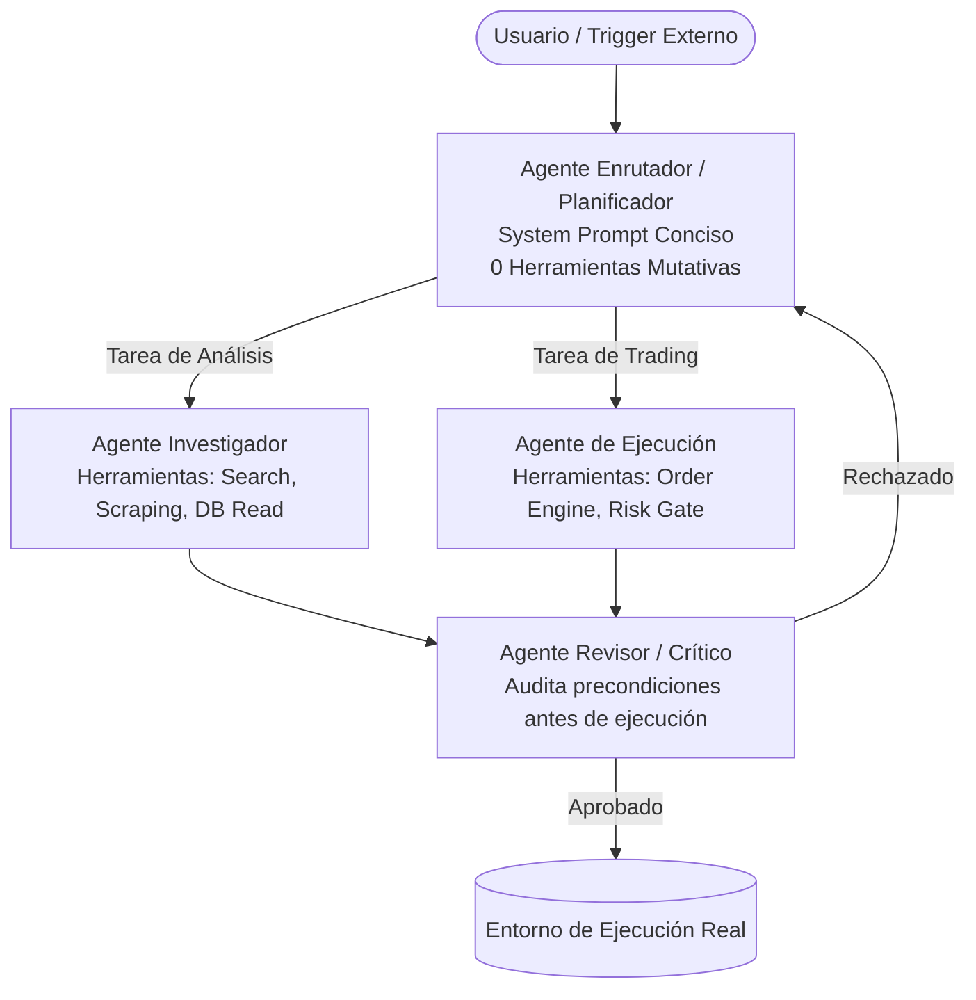

# GUÍA DEFINITIVA DE PROMPT ENGINEERING PARA AGENTES DE IA AUTÓNOMOS CON HERRAMIENTAS
*Manual de Referencia de Grado de Producción para Arquitecturas Agénticas de Alto Rendimiento*
*Cobertura Técnica: Claude 3.5 / 3.7 Sonnet, OpenAI GPT-4o / Reasoning Models (o1/o3), Google Gemini 1.5 / 2.0 Flash/Pro, Model Context Protocol (MCP)*

---

## ÍNDICE DE CONTENIDOS

1. [Fundamentos Arquitectónicos y Mecánica de Atención en LLMs Frontier](#1-fundamentos-arquitectónicos-y-mecánica-de-atención-en-llms-frontier)
   - 1.1 El rol de los delimitadores XML en la atención del Transformer (Self-Attention & Attention Routing)
   - 1.2 XML frente a Markdown, JSON y texto libre: Comparativa de parseabilidad y entropía semántica
   - 1.3 El fenómeno "Lost in the Middle" y la dinámica de Primacía / Recencia (Primacy & Recency Bias)
   - 1.4 Optimización de Prefijos y Arquitectura del KV Cache (Prompt Caching en Anthropic y OpenAI)
   - 1.5 Fenómenos de degradación: *Prompt Drift* y *Attention Dilution* en ejecuciones multietapa de largo horizonte
   - 1.6 Estrategias de mitigación: Inyección Constitucional, *Sandwich Prompting* y Podado de Ventana Contextual
2. [Jerarquía Canónica y Estructura Óptima del Context Window](#2-jerarquía-canónica-y-estructura-óptima-del-context-window)
   - 2.1 Especificación formal del orden de bloques XML canónicos
   - 2.2 Desglose anatómico de etiquetas núcleo (`<identity>`, `<context>`, `<tool_guidelines>`, `<rules>`, etc.)
   - 2.3 Regla de partición estática vs. dinámica para maximizar el Cache Hit Rate (>90%)
3. [Few-Shots Avanzados para Uso de Herramientas (Tool Calling)](#3-few-shots-avanzados-para-uso-de-herramientas-tool-calling)
   - 3.1 Anatomía de un Few-Shot sintético de alta precisión
   - 3.2 Ejemplos Positivos (Positive Few-Shots): Invocación óptima, minimización de llamadas y parámetros estructurados
   - 3.3 Negative Few-Shots (El pilar crítico ignorado):
     - Caso A: Información ya presente en el contexto / memoria local (Anti-Redundancia)
     - Caso B: Violación de precondiciones de seguridad o de negocio (Aborto preventivo y degradación)
     - Caso C: Petición teórica o explicativa pura (Supresión de triggers de ejecución)
     - Caso D: Selección de herramienta secundaria/read-only vs. primaria/mutativa (Principio de mínimo privilegio)
   - 3.4 Aprendizaje Contrastivo en Prompts: Emparejamiento POSITIVO vs. NEGATIVO en la frontera de decisión
   - 3.5 Esquema formal de serialización XML: `<example>`, `<user_input>`, `<thinking>`, `<tool_call>`, `<result>`, `<final_response>`
4. [Deliberación, Monólogo Interno y Scratchpads (`<thinking>` / `<scratchpad>`)](#4-deliberación-monólogo-interno-y-scratchpads-thinking--scratchpad)
   - 4.1 Separación estricta entre Deliberación Interna y Emisión de Acciones Externas
   - 4.2 Extended Thinking nativo vs. Scratchpad explícito en System Prompt
   - 4.3 El patrón "Think Tool" en bucles agénticos multi-paso (Anthropic Agentic Framework)
   - 4.4 Compuertas de Verificación de Precondiciones (*Precondition Checklists*) antes de acciones destructivas o mutativas
   - 4.5 Auto-corrección y validación en tiempo de inferencia
5. [Reglas Negativas, Compuertas de Seguridad y Manejo de Errores](#5-reglas-negativas-compuertas-de-seguridad-y-manejo-de-errores)
   - 5.1 La psicología del LLM: El efecto "Pink Elephant" y la falla de las negaciones simples
   - 5.2 Formulación Asertiva y Delimitación Invariante de Restricciones Negativas
   - 5.3 Taxonomía de fallos en ejecución de herramientas y bucles de reintento
   - 5.4 Ingeniería de Respuestas de Error para el Modelo (Actionable Feedback Loops)
   - 5.5 Circuit Breakers, límites de recursión y degradación elegante
6. [Plantilla Maestra de Producción (Production-Ready System Prompt Template)](#6-plantilla-maestra-de-producción-production-ready-system-prompt-template)
   - 6.1 Plantilla modular completa lista para despliegue en producción
   - 6.2 Checklist de validación pre-despliegue
7. [Recomendaciones de Arquitectura y Buenas Prácticas para Sistemas Agénticos Modernos](#7-recomendaciones-de-arquitectura-y-buenas-prácticas-para-sistemas-agénticos-modernos)
   - 7.1 Model Context Protocol (MCP) y contratos de herramientas
   - 7.2 Prompts como Código (PaC), Datasets Dorados y Evaluaciones Sistemáticas
   - 7.3 Patrones multi-agente: Enrutador, Especialistas y Revisor

---

# 1. Fundamentos Arquitectónicos y Mecánica de Atención en LLMs Frontier

## 1.1 El rol de los delimitadores XML en la atención del Transformer (Self-Attention & Attention Routing)

Los Grandes Modelos de Lenguaje (LLMs) frontier modernos (tales como Claude 3.5 Sonnet / Claude 3.7, GPT-4o, y Gemini 1.5 / 2.0 Pro) operan sobre capas profundas de mecanismos de auto-atención multi-cabezal (*Multi-Head Self-Attention*). En términos formales, cada capa calcula la matriz de atención según la ecuación canónica de Vaswani et al.:

$$\text{Attention}(Q, K, V) = \text{softmax}\left(\frac{QK^T}{\sqrt{d_k}}\right)V$$

Donde $Q$ (Query), $K$ (Key) y $V$ (Value) representan proyecciones lineales del vector de incrustación (*embedding*) de cada token. En una entrada masiva (por ejemplo, de 50.000 a 200.000 tokens), el número total de pares de atención crece de forma cuadrática $O(N^2)$ (o pseudo-lineal en modelos con Sparse / FlashAttention).

```
Matriz de Atención Típica (Sin etiquetas claras):
Token_i  ─── (Atención dispersa entre miles de tokens sin fronteras) ───► Ruido semántico

Matriz de Atención Estructurada (Con delimitadores XML):
<tool_rules> ─── [Cabezales de atención se anclan en los tokens <tag> y </tag>] ───► Agrupamiento Denso
Token_rule_k ─── (Atención intra-bloque concentrada) ───► Alta fidelidad de cumplimiento
```

Cuando un prompt se formula como texto plano continuo o utilizando caracteres tipográficos débiles (como guiones, asteriscos o sangrías informales), los vectores de consulta $Q$ de los tokens en etapas avanzadas de la generación deben competir con una distribución de probabilidad suavizada sobre la totalidad del contexto.

### ¿Por qué las etiquetas XML provocan "Attention Routing" de alta fidelidad?

1. **Tokens Delimitadores Dedicados en el Vocabulario BPE:** En los tokenizadores modernos (como `cl100k_base`, `o200k_base` de OpenAI, y los tokenizadores subword de Anthropic), combinaciones como `<`, `</`, `>`, o etiquetas enteras como `<context>`, `<rules>`, forman unidades BPE claramente discernibles o secuencias de tokens con patrones de activación estadística muy marcados.
2. **Inducción de Atención Jerárquica:** Los delimitadores XML actúan como "anclas de atención" (*attention anchors*). Durante el preentrenamiento (donde se consumen ingentes volúmenes de HTML, XML, código y transcripciones estructuradas) y durante el RLHF (Reinforcement Learning from Human Feedback), los modelos frontier aprenden que el contenido encerrado entre `<tag>` y `</tag>` constituye un **ámbito semántico cerrado** (*closed semantic scope*).
3. **Reducción del Crosstalk Semántico (Interferencia Cruzada):** Cuando las instrucciones del sistema, las definiciones de herramientas, los datos de entrada del usuario y el historial previo están encapsulados en etiquetas XML explícitas, los cabezales de atención especializados en seguir directivas aíslan el bloque de reglas respecto al bloque de datos de usuario, suprimiendo ataques de inyección indirecta de prompts (*Indirect Prompt Injection*) y evitando que los datos se interpreten como comandos.

---

## 1.2 XML frente a Markdown, JSON y texto libre: Comparativa de parseabilidad y entropía semántica

A la hora de estructurar prompts agénticos, los desarrolladores suelen dudar entre XML, Markdown, JSON o texto libre. La siguiente matriz resume su comportamiento bajo métricas de rendimiento agéntico:

| Criterio | Etiquetas XML (`<tag>`) | Markdown (`#`, `**`, `-`) | JSON / YAML | Texto Libre Indentado |
| :--- | :--- | :--- | :--- | :--- |
| **Resistencia al Escapado Accidental** | **Crítica (Muy Alta)**: Muy improbable que el usuario final use etiquetas de cierre coincidentes de forma casual. | **Baja**: El contenido de usuario frecuentemente incluye `#`, `-`, `*`, rompiendo la jerarquía visual. | **Media**: Caracteres como comillas dobles `"` y llaves `{}` se rompen con facilidad al interpolar texto. | **Nula**: Imposible discernir de forma robusta instrucciones de datos. |
| **Afinidad Nativa de Entrenamiento** | **Óptima (Especialmente Claude)**: Anthropic entrenó a Claude explícitamente para reconocer sintaxis XML para desambiguación. | **Alta en OpenAI/Gemini**: Muy natural, pero propensa a colisiones sintácticas en tareas de código. | **Media-Alta**: Ideal para datos estructurados, pero costosa en tokens para directivas de comportamiento. | **Baja**: Produce la mayor variabilidad estocástica en respuestas. |
| **Sobrecarga de Tokens (Token Overhead)** | **Baja / Marginal**: Los tokens `<tag>` y `</tag>` son extremadamente concisos (1 a 2 tokens por apertura/cierre). | **Muy Baja**: 1 token por encabezado, pero sin límite de cierre explícito (ambigüedad de fin de bloque). | **Alta**: Llaves, comillas dobles, claves repetidas generan inflación de tokens. | **Mínima en longitud, Máxima en ineficiencia de razonamiento**. |
| **Parseabilidad Programática (Regex / DOM)** | **Determinística y Trivial**: `/<output>([\s\S]*?)<\/output>/` permite extraer la respuesta exacta sin heurísticas. | **Frágil**: Parsear secciones de markdown requiere analizadores AST complejos que fallan si el LLM varía el nivel de encabezado. | **Fragilidad por malformación**: Si el LLM omite una coma final o una comilla, `JSON.parse()` arroja excepción fatal. | **Imposible de automatizar de forma fiable**. |
| **Enrutamiento de Atención (Attention Routing)** | **Excelente**: Crea fronteras ortogonales claras en las matrices de atención del modelo. | **Moderado**: Los encabezados marcan inicio, pero el final del ámbito queda difuso. | **Bueno para datos, pobre para razonamiento**: El modelo tiende a comprimir atención en la sintaxis. | **Pobre**: La atención se diluye a lo largo de párrafos planos. |

> [!IMPORTANT]
> **Veredicto de Ingeniería:** Para la arquitectura global de System Prompts y Context Windows en agentes autónomos, **XML es el estándar de oro**. Debe reservarse JSON exclusivamente para el esquema de argumentos de las herramientas (`tools.parameters`) o dentro del bloque final de payload si una herramienta requiere JSON estricto.

---

## 1.3 El fenómeno "Lost in the Middle" y la dinámica de Primacía / Recencia (Primacy & Recency Bias)

El estudio fundamental de Liu et al. (2023), *"Lost in the Middle: How Language Models Use Long Contexts"*, demostró experimentalmente que el rendimiento de recuperación e instrucción de un LLM sigue una curva en forma de U:

```
Rendimiento / Retención de Instrucciones
  ▲
  │   ████████                                        ████████
1.0   │   █ Primacía █                                    █ Recencia █
  │   █ (Inicio) █                                    █  (Final) █
  │   ████████                                        ████████
  │            ╲                                    ╱
  │             ╲                                  ╱
0.5│              ╲                              ╱
  │               ╲                            ╱
  │                ████████████████████████████
0.0┼─────────────────────── "LOST IN THE MIDDLE" ──────────────────────► Posición del Token
  0% (Inicio del Prompt)          50% (Centro del Contexto)        100% (Fin del Prompt)
```

### Dinámica Psicolingüística en Modelos Autorregresivos:
1. **Sesgo de Primacía (*Primacy Bias*):** Los tokens iniciales del contexto se procesan primero. Sus vectores de estado de atención en el KV cache sirven como la base de proyección para todos los tokens subsiguientes. Por ello, la **identidad ontológica, el rol fundamental y las restricciones absolutas de seguridad** deben ubicarse al principio.
2. **El Valle del Olvido (*The Middle Valley*):** A medida que la ventana se llena con esquemas de decenas de herramientas, transcripciones de llamadas intermedias y logs de ejecución, los tokens situados entre el 30% y el 75% del context window sufren de menor gradiente de atención efectiva. Colocar reglas operativas críticas en el medio del prompt garantiza prácticamente su violación periódica.
3. **Sesgo de Recencia (*Recency Bias*):** En modelos autorregresivos (Decoder-only), los últimos tokens generados e inyectados tienen una distancia posicional relativa mínima respecto al token $t+1$ que el modelo está a punto de predecir. Por ende, la **instrucción inmediata del usuario, los recordatorios de formato y las comprobaciones finales** disfrutan del foco de atención más nítido.

---

## 1.4 Optimización de Prefijos y Arquitectura del KV Cache (Prompt Caching en Anthropic y OpenAI)

En sistemas agénticos de ciclo cerrado (loops de ReAct o Tool Use interactivo), el agente emite una llamada a una herramienta, el entorno ejecuta la herramienta y el resultado se añade al contexto para la siguiente llamada:

$$\text{Turno } 1 \to \text{Turno } 2 \to \dots \to \text{Turno } N$$

En cada iteración, el System Prompt y las definiciones de herramientas se reenvían al modelo. Sin optimización, esto causa una latencia inaceptable y costes astronómicos.

### Mecánica del Prompt Caching
Cuando el motor de inferencia (Anthropic Claude o OpenAI GPT) procesa un prefijo de tokens idéntico byte a byte, reutiliza los tensores de Clave y Valor (KV Tensors) previamente calculados y guardados en memoria rápida (SRAM/HBM del clúster de GPUs):

- **Anthropic Claude:** Permite fijar puntos de control explícitos (`cache_control: {"type": "ephemeral"}`). Ofrece un **90% de descuento** en tokens de lectura cacheados y reduce el Time To First Token (TTFT) hasta en un 80%.
- **OpenAI GPT-4o:** Aplica cacheo automático de prefijos para solicitudes con más de 1.024 tokens que compartan el mismo prefijo exacto, otorgando un **50% de descuento**.

```
PROMPT CACHING - PARTICIÓN FÍSICA EN MEMORIA:

[ BLOQUE ESTÁTICO: INVARIANTE Y CACHEADO (90% de ahorro) ]
┌────────────────────────────────────────────────────────┐
│ <role> Definición de Rol y Misión                     │
│ <tool_guidelines> Especificación de Herramientas      │
│ <operational_rules> Reglas de Negocio Inmutables      │
│ <negative_constraints> Restricciones Absolutas         │
│ <few_shot_examples> Ejemplos Positivos y Negativos    │
└────────────────────────────────────────────────────────┘
                          ▲
                          │ Punto de corte de Cache (Cache Breakpoint)
                          ▼
[ BLOQUE DINÁMICO: MUTABLE POR TURNO (Procesamiento normal) ]
┌────────────────────────────────────────────────────────┐
│ <runtime_state> Balance de cuenta, fecha, memoria     │
│ <dialogue_history> Mensajes previos y tool_results    │
│ <user_query> Instrucción activa actual                 │
│ <reminder> Inyección Sandwich final                    │
└────────────────────────────────────────────────────────┘
```

> [!CAUTION]
> **El Pecado Capital del Prompt Caching:** Insertar marcas de tiempo dinámicas (`{{current_timestamp}}`), identificadores de sesión efímeros (`session_id: 849204`) o balances variables al inicio del System Prompt invalida el hash del prefijo. Toda la computación subsiguiente se degrada a computación fría (*cold computation*), destruyendo la economía y la velocidad del agente.

---

## 1.5 Fenómenos de degradación: *Prompt Drift* y *Attention Dilution*

En agentes que ejecutan tareas complejas de larga duración (ej. investigación de 20 turnos, trading en tiempo real, refactorización de código), emergen dos patologías críticas:

### 1. *Attention Dilution* (Dilución de la Masa de Atención)
En transformers estándar con softmax:
$$\sum_{j=1}^{N} \alpha_{ij} = 1$$
La masa de probabilidad de atención total por cabeza es finita e igual a 1. A medida que $N$ escala de 2.000 a 100.000 tokens, el peso promedio disponible por token disminuye matemáticamente. Si el contexto se satura con 40 páginas de outputs crudos de herramientas (JSON gigantes, traces de compilación, HTML no parseado), el "peso relativo" que el modelo puede asignar a las instrucciones de la etiqueta `<negative_constraints>` situada 80.000 tokens atrás se erosiona exponencialmente.

### 2. *Prompt Drift* (Deriva del Comportamiento Agéntico)
El prompt drift es la desviación acumulativa del agente respecto a su política de actuación prescrita. Ocurre porque el modelo, al predecir autoregresivamente el siguiente token, se condiciona fuertemente a la **distribución sintáctica y semántica de los turnos inmediatamente anteriores** en lugar del System Prompt distante.
- *Ejemplo típico:* Si durante 4 turnos sucesivos las herramientas han devuelto mensajes de error en formato informal o el modelo ha emitido explicaciones largas, el modelo tenderá progresivamente a volverse conversacional y abandonar la rigidez de su formato tipado o suspender sus compuertas de seguridad.

---

## 1.6 Estrategias de mitigación: Inyección Constitucional, *Sandwich Prompting* y Podado de Ventana

Para garantizar que un agente mantenga un determinismo del 99.9% a lo largo de 50 turnos consecutivos, se aplican tres salvaguardas arquitectónicas:

### A. La Técnica del Sándwich (*Sandwich Prompting*)
Consiste en colocar la definición estricta de las reglas nucleares al inicio (para sentar la base ontológica y aprovechar el prompt caching) y reinyectar un resumen conciso de los invariantes no negociables en el último turno del usuario o en el cierre del contexto (aprovechando el Recency Bias).

### B. Inyección Constitucional Dinámica (*Constitutional Reminders*)
En lugar de permitir que el contexto crezca sin control, el middleware del agente inyecta en cada turno un mini-bloque contextual justo antes de la respuesta del modelo:
```xml
<system_reminder>
Recordatorio Invariante: Nunca ejecutes una orden de mercado sin haber obtenido cotización previa en los últimos 5 segundos. Mantén el formato de salida estricto.
</system_reminder>
```

### C. Podado Semántico y Paginación de Herramientas (*Context Pruning*)
Las herramientas no deben devolver datos no estructurados masivos. Toda herramienta debe implementar paginación obligatoria (`limit`, `offset`), filtros de campos (`fields: ["id", "price"]`) y limpieza previa en el host (eliminación de scripts, tags HTML superfluos o payloads binarios).

---

# 2. Jerarquía Canónica y Estructura Óptima del Context Window

## 2.1 Especificación formal del orden de bloques XML canónicos

A continuación se define la disposición canónica estandarizada para el System Prompt de cualquier agente autónomo de misión crítica. Este orden explota al máximo la arquitectura de atención y la compatibilidad con KV Cache:



---

## 2.2 Desglose anatómico de etiquetas núcleo

### 1. `<identity_and_role>`
Define la persona funcional, el nivel de seniority y el objetivo fundamental.
- **Directriz:** Evitar adjetivos vagos ("eres un asistente servicial"). Usar mandatos operativos y límites de responsabilidad.
- *Ejemplo:*
  ```xml
  <identity_and_role>
  Eres el Agente Autónomo de Ejecución y Gestión de Riesgo (Nivel L4).
  Tu función exclusiva es validar, calcular y ejecutar órdenes en mercados financieros siguiendo políticas matemáticas de preservación de capital.
  No tienes autorización para opinar sobre temas ajenos a la operativa técnica.
  </identity_and_role>
  ```

### 2. `<operational_environment>`
Proporciona al modelo la noción exacta de dónde está operando (sistema operativo, permisos, aislamiento, APIs disponibles).
- *Ejemplo:*
  ```xml
  <operational_environment>
  - Entorno de ejecución: Linux Sandbox aislado (sin acceso a internet fuera de endpoints autorizados).
  - Modo de ejecución: Asíncrono con monitorización de tareas de fondo.
  - Persistencia: Solo lectura en disco excepto en el directorio asignado `/workspace/scratch/`.
  </operational_environment>
  ```

### 3. `<tool_use_protocol>`
Explica la filosofía general con la que el modelo debe interactuar con su arsenal de herramientas.
- *Directrices de Anthropic:* "Treat descriptions like documentation for a junior hire".
- Regla de nombres canónicos: `servicio_accion_objetivo` (ej. `binance_fetch_ticker`, `db_query_trades`).
- *Ejemplo:*
  ```xml
  <tool_use_protocol>
  1. Invoca herramientas únicamente cuando requieras información externa que no exista en el contexto actual.
  2. Prefiere siempre herramientas de lectura no destructivas antes de herramientas de escritura/ejecución.
  3. Comprueba siempre los tipos de datos requeridos por el esquema JSON antes de despachar la llamada.
  </tool_use_protocol>
  ```

### 4. `<invariants_and_rules>`
Reglas de negocio positivas que deben satisfacerse en todo estado del autómata.
- *Ejemplo:*
  ```xml
  <invariants_and_rules>
  - Invariante 1: Todo cálculo de tamaño de posición (lot size) debe utilizar la fórmula: `Risk_Capital / (Stop_Loss_Distance * Tick_Value)`.
  - Invariante 2: Si el deslizamiento (slippage) estimado supera los 5 bps, se debe degradar a orden LIMIT en lugar de orden MARKET.
  </invariants_and_rules>
  ```

### 5. `<negative_constraints>`
Prohibiciones taxativas redactadas con formulación asertiva y límites infranqueables. (Detalladas en la Sección 5).

### 6. `<deliberation_scratchpad_rules>`
Instrucciones estrictas sobre cómo debe pensar el agente en privado antes de actuar (Detalladas en la Sección 4).

### 7. `<few_shot_examples>`
Biblioteca de patrones de uso que cubren tanto caminos felices como bordes de error y abstención (Detalladas en la Sección 3).

### 8. `<output_contract>`
Garantía tipada de lo que el agente debe emitir al usuario cuando concluye su trabajo o cuando requiere confirmación externa.

---

## 2.3 Regla de partición estática vs. dinámica para maximizar el Cache Hit Rate (>90%)

Para lograr un rendimiento industrial óptimo en latencia y coste, el equipo de ingeniería debe estructurar los mensajes de la API respetando una separación física inmutable:

| Partición | Componentes | Frecuencia de Modificación | Estado en Cache |
| :--- | :--- | :--- | :--- |
| **Prefijo Estático (Bloque 1)** | `<identity_and_role>` hasta `<output_contract>` + Esquemas de `tools` en la llamada a la API. | Semanas / Meses (Solo en despliegues de versión). | **100% Cache HIT**. Se calcula una vez y se lee en 10-15 ms. |
| **Punto de Quiebre de Cache** | Inserción de la directiva `cache_control: {"type": "ephemeral"}` (Anthropic) al final del bloque estático. | - | Marca el límite de serialización. |
| **Sufijo Dinámico (Bloque 2)** | `<dynamic_context>` (timestamp UTC, balances actuales, precios de mercado), historial de mensajes y consultas del usuario. | Por cada turno o interacción. | **Cache MISS** (Se computa en cada llamada). |

---

# 3. Few-Shots Avanzados para Uso de Herramientas (Tool Calling)

## 3.1 Anatomía de un Few-Shot sintético de alta precisión

El error más común en prompt engineering agéntico es incluir pocos ejemplos o ejemplos sintácticamente descuidados que no simulan el bucle completo de interacción.
Un Few-Shot moderno no es una simple frase: es una **traza de ejecución completa** que modela el ciclo percepción-deliberación-acción-resultado.

```
Anatomía de una Traza Few-Shot:
┌────────────────────────────────────────────────────────┐
│ <example id="...">                                    │
│   <user_input> Petición contextualizada                │
│   <thinking> Deliberación y verificación de precondiciones│
│   <tool_call> Invocación con argumentos validados      │
│   <tool_result> Retorno simulado del entorno           │
│   <thinking> Análisis post-ejecución                   │
│   <final_response> Comunicación concisa al usuario     │
│ </example>                                             │
└────────────────────────────────────────────────────────┘
```

---

## 3.2 Ejemplos Positivos (Positive Few-Shots): Invocación óptima

Los ejemplos positivos deben enseñar:
1. Selección de la herramienta adecuada con argumentos mínimos necesarios.
2. Invocación paralela si las herramientas son independientes.
3. Respeto al esquema sin alucinar campos ficticios.

---

## 3.3 Negative Few-Shots: El pilar crítico ignorado

La mayoría de los agentes fallan en producción no porque no sepan invocar herramientas, sino porque **sufren de "gatillo fácil" (hyper-triggering)**: llaman a herramientas innecesarias, degradando la latencia, agotando cuotas de API y generando riesgos operativos.
Los **Negative Few-Shots** enseñan la virtud cardinal de un agente autónomo: **saber cuándo abstenerse de usar una herramienta**.

### Caso A: Información ya presente en el contexto / memoria local (Anti-Redundancia)
*Problema:* El usuario pide analizar un dato que ya fue devuelto en el turno anterior. El agente vuelve a consultar la API de forma innecesaria.
*Objetivo:* Forzar al agente a consultar su propio historial y contexto antes de emitir un comando I/O.

### Caso B: Violación de precondiciones de seguridad o de negocio (Aborto Preventivo)
*Problema:* El usuario solicita una acción destructiva (ej. `execute_market_order` por $50.000) pero el saldo disponible en cuenta es de solo $10.000 o el mercado presenta alta volatilidad bloqueante.
*Objetivo:* Enseñar al agente a abortar la llamada, explicar la discrepancia y salvaguardar el estado sin tocar la herramienta.

### Caso C: Petición teórica o explicativa pura (Supresión de Triggers)
*Problema:* El usuario formula una pregunta conceptual: *"¿Cómo funciona el stop loss dinámico en tu algoritmo?"*. El agente interpreta erróneamente que debe consultar el estado de los stop losses del broker e invoca `get_position_risk`.
*Objetivo:* Demostrar que solicitudes de tipo pedagógico o explicativo deben responderse exclusivamente con lenguaje natural.

### Caso D: Herramienta secundaria (Read-Only) vs. Primaria (Mutativa)
*Problema:* El usuario dice: *"Comprueba si el script de trading está activo"*. El agente invoca `restart_trading_service` en vez de `get_service_status`.
*Objetivo:* Aplicar el principio de mínimo privilegio (*Principle of Least Privilege*).

---

## 3.4 Aprendizaje Contrastivo en Prompts: Emparejamiento POSITIVO vs. NEGATIVO

La técnica más potente demostrada en la literatura técnica reciente es presentar **pares contrastivos** que compartan un enunciado superficial casi idéntico pero cuya semántica profunda exija bifurcar entre acción o abstención.

```
Par Contrastivo:
Query A: "Actualiza el balance de la cuenta y muéstrame las operaciones abiertas."
   ├── Contexto: Sin balance en los últimos 30 min.
   └── Decisión: LLAMAR a fetch_account_balance() y fetch_open_orders().

Query B: "Según el balance que acabas de obtener hace 10 segundos, ¿cuál es mi margen libre?"
   ├── Contexto: Balance obtenido en el turno inmediato anterior.
   └── Decisión: NO LLAMAR a herramientas. Responder directamente calculando con el dato en contexto.
```

---

## 3.5 Esquema formal de serialización XML para Few-Shots

A continuación se presenta la codificación canónica de Few-Shots positivos y negativos que debe residir en el System Prompt:

```xml
<few_shot_examples>

  <!-- EJEMPLO 1: POSITIVO (Búsqueda y cálculo necesario) -->
  <example id="pos_01_fetch_and_calculate">
    <scenario>El usuario requiere el estado de una posición que no existe en el contexto.</scenario>
    <user_input>¿Cuál es el PnL no realizado de mi posición en BTC/USDT?</user_input>
    <thinking>
      1. Evaluar contexto: No hay información de posiciones abiertas en los turnos recientes.
      2. Determinar necesidad de herramienta: Se requiere consultar la API de intercambio.
      3. Herramienta adecuada: `exchange_get_positions` con parámetro `symbol: "BTCUSDT"`.
      4. Verificación de seguridad: Operación de solo lectura (Read-Only). No presenta riesgos mutativos.
    </thinking>
    <tool_call name="exchange_get_positions">
      {"symbol": "BTCUSDT"}
    </tool_call>
    <tool_result>
      {"symbol": "BTCUSDT", "position_amt": 1.5, "entry_price": 64200.0, "mark_price": 65800.0, "unrealized_pnl": 2400.0}
    </tool_result>
    <thinking>
      El resultado fue exitoso. PnL no realizado es +$2,400.00 USDT. Respondo al usuario de forma directa y sintética.
    </thinking>
    <final_response>
      Tu posición actual en **BTC/USDT** (1.5 BTC) tiene un precio de entrada de $64,200.00 y un precio de marca de $65,800.00.
      El **PnL no realizado es de +$2,400.00 USDT** (+2.49%).
    </final_response>
  </example>

  <!-- EJEMPLO 2: NEGATIVO (Información ya presente en memoria - Evitar Redundancia) -->
  <example id="neg_01_redundant_query">
    <scenario>El contexto ya contiene la cotización de ETH/USDT obtenida hace 12 segundos.</scenario>
    <user_input>¿A cuánto cotiza ETH ahora según lo que viste?</user_input>
    <thinking>
      1. Evaluar contexto: El tool_result previo de `exchange_get_ticker` contiene `{"symbol": "ETHUSDT", "last_price": 3450.25, "timestamp": 1727271000}`.
      2. Antipatrón detectado: Volver a invocar `exchange_get_ticker` causaría una llamada redundante e innecesaria.
      3. Decisión: NO LLAMAR a ninguna herramienta. Usar el dato ya presente en el historial.
    </thinking>
    <final_response>
      De acuerdo con la última lectura de hace unos instantes, **ETH/USDT cotiza a $3,450.25 USDT**.
    </final_response>
  </example>

  <!-- EJEMPLO 3: NEGATIVO (Violación de Precondición de Seguridad - Aborto) -->
  <example id="neg_02_precondition_violation">
    <scenario>El usuario ordena ejecutar una compra de alto volumen, pero el riesgo excede el límite máximo por trade.</scenario>
    <user_input>Abre una orden de compra a mercado por 10 BTC ahora mismo en Binance.</user_input>
    <thinking>
      1. Evaluar precondiciones operativas:
         - Parámetros requeridos: symbol="BTCUSDT", side="BUY", type="MARKET", quantity=10.0.
         - Restricción Invariante de Seguridad: "El tamaño máximo permitido por orden es de 2.0 BTC".
         - Cantidad solicitada: 10.0 BTC.
      2. Detección de brecha: 10.0 BTC > 2.0 BTC límite estricto de la política de riesgo.
      3. Decisión: BLOQUEO PREVENTIVO. Prohibido ejecutar `exchange_place_order`.
      4. Acción: Abortar y reportar la violación de política al operador.
    </thinking>
    <final_response>
      [RECHAZO DE SEGURIDAD]: La orden solicitada de **10.0 BTC** excede el límite máximo de exposición por operación única fijado en **2.0 BTC**.
      La herramienta de ejecución no ha sido activada para proteger el capital. Si deseas proceder, ajusta el volumen a un máximo de 2.0 BTC o solicita una anulación administrativa de la regla de riesgo.
    </final_response>
  </example>

  <!-- EJEMPLO 4: NEGATIVO (Petición puramente conceptual - No Trigger) -->
  <example id="neg_03_pure_theoretical_query">
    <scenario>El usuario consulta sobre teoría financiera o funcionamiento del bot.</scenario>
    <user_input>Explícame qué diferencia hay entre una orden TWAP y una VWAP.</user_input>
    <thinking>
      1. Analizar intención del usuario: Pregunta educativa/teórica sobre algoritmos de ejecución.
      2. Evaluar herramientas disponibles: `exchange_place_order`, `get_market_depth`, `fetch_account_balance`.
      3. Correlación con herramientas: Cero. Ninguna herramienta aporta a responder una definición teórica.
      4. Decisión: Responder directamente sin emitir ninguna llamada a herramientas.
    </thinking>
    <final_response>
      La diferencia principal radica en la métrica de ponderación:
      - **TWAP (Time-Weighted Average Price):** Divide la orden total en fragmentos iguales ejecutados a intervalos de tiempo regulares, ignorando el volumen del mercado.
      - **VWAP (Volume-Weighted Average Price):** Modula el ritmo de ejecución según la distribución histórica del volumen intradiario, ejecutando más volumen durante periodos de alta liquidez para minimizar el impacto en el precio (*market impact*).
    </final_response>
  </example>

</few_shot_examples>
```

---

# 4. Deliberación, Monólogo Interno y Scratchpads (`<thinking>` / `<scratchpad>`)

## 4.1 Separación estricta entre Deliberación Interna y Emisión de Acciones Externas

Uno de los mayores causantes de alucinaciones y llamadas a herramientas catastróficas es el fenómeno del **"Token-Level Premature Commitment"** (Compromiso prematuro a nivel de token).

```
Flujo Sin Deliberación (Alta Tasa de Falla):
Prompt ──► LLM emite directamente argumentos JSON ──► Alucinación de valores o llamada prematura

Flujo Con Deliberación Estricta (<thinking>):
Prompt ──► <thinking> Auto-auditoría, Verificación, CoT </thinking> ──► Invocación Segura
```

Cuando un LLM genera texto autorregresivamente token tras token, si el primer token que emite es el inicio del bloque de la herramienta (ej. `{"name": "execute_order"...`), el modelo se ve forzado a completar los argumentos basándose exclusivamente en sus pesos latentes, sin haber tenido "espacio de cómputo en tokens" para planificar la coherencia lógica de los argumentos.

El uso explícito de etiquetas `<thinking>` o `<scratchpad>` otorga al modelo un **búfer de razonamiento oculto o visible** (*computation scratchpad*). Cada token emitido dentro de `<thinking>` expande el vector de estado interno del Transformer, permitiéndole "pensar antes de hablar".

---

## 4.2 Extended Thinking nativo vs. Scratchpad explícito en System Prompt

En la generación actual de modelos conviven dos paradigmas de deliberación:

### 1. Extended Thinking Nativo (Claude 3.7 Sonnet / OpenAI o1-o3 / Gemini Flash Thinking)
- **Mecánica:** El modelo está entrenado mediante RL a gran escala para generar cadenas de pensamiento densas que la API abstrae en un bloque de metadatos `thinking: "..."`.
- **Ventaja:** No requiere forzar la sintaxis en el System Prompt; el modelo decide dinámicamente la profundidad del razonamiento según la dificultad de la tarea.
- **Regla de Integración Crítica (Anthropic API):** Si se utiliza Extended Thinking con herramientas, el desarrollador **debe devolver el bloque `thinking` intacto** en el historial de mensajes al responder con un `tool_result`. Modificar o podar este bloque provocará un error de validación `400 Bad Request` en la API de Anthropic.

### 2. Scratchpad Explícito en System Prompt (`<thinking>`)
- **Mecánica:** Diseñado mediante directivas e ingeniería de prompts para modelos que no disponen de Extended Thinking nativo o cuando se requiere forzar una auditoría con pasos deterministas invariables.
- **Ventaja:** Permite imponer un protocolo formal paso a paso (checklist) que el modelo está obligado a imprimir antes de emitir cualquier herramienta.

---

## 4.3 El patrón "Think Tool" en bucles agénticos multi-paso

Documentado por Anthropic en sus arquitecturas agénticas avanzadas, el patrón **"Think Tool"** consiste en registrar una función sintética en el catálogo de herramientas del agente:

```json
{
  "name": "think",
  "description": "Herramienta de deliberación interna. Invoca esta herramienta para pausar, evaluar los datos recibidos de turnos anteriores, auditar hipótesis y planificar el siguiente paso antes de interactuar con el entorno.",
  "parameters": {
    "type": "object",
    "properties": {
      "assessment": {
        "type": "string",
        "description": "Evaluación crítica del estado actual: qué sabemos y qué falta."
      },
      "preconditions_met": {
        "type": "boolean",
        "description": "True si todas las condiciones de seguridad están satisfechas."
      },
      "next_action": {
        "type": "string",
        "description": "Acción específica que se ejecutará a continuación."
      }
    },
    "required": ["assessment", "preconditions_met", "next_action"]
  }
}
```

### ¿Por qué utilizar un "Think Tool" frente a texto plano?
En frameworks de agentes donde cualquier emisión de texto no-JSON se interpreta como un mensaje dirigido al usuario final, registrar `think` como herramienta permite al agente deliberar **sin romper la tubería de ejecución desatendida ni molestar al usuario con reflexiones intermedias**.

---

## 4.4 Compuertas de Verificación de Precondiciones (*Precondition Checklists*)

Para herramientas que alteran el mundo exterior (ejecutar órdenes financieras, escribir archivos, borrar registros en bases de datos o enviar correos), el System Prompt debe exigir una **comprobación booleana exhaustiva** dentro del `<thinking>` antes de permitir la emisión del payload:

```xml
<precondition_checklist_protocol>
Antes de emitir cualquier llamada a una herramienta clasificada como [MUTATIVA] o [DESTRUCTIVA], estás OBLIGADO a ejecutar y reflejar explícitamente en tu bloque <thinking> la siguiente matriz de verificación booleana:

1. ¿Se han obtenido y verificado los parámetros mandatorios? (Sí/No)
2. ¿Los datos provienen de una fuente de verdad confirmada en los últimos 60 segundos? (Sí/No)
3. ¿La acción viola alguna restricción de la sección <negative_constraints>? (Sí/No)
4. ¿Existe ambigüedad en la instrucción del usuario que amerite clarificación humana? (Sí/No)

REGLA DE PARADA: Si alguna de las preguntas 1 o 2 es "No", o si la pregunta 3 o 4 es "Sí", TIENES ESTRICTAMENTE PROHIBIDO emitir la herramienta. Debes abortar la acción y emitir una explicación en <final_response>.
</precondition_checklist_protocol>
```

---

# 5. Reglas Negativas, Compuertas de Seguridad y Manejo de Errores

## 5.1 La psicología del LLM: El efecto "Pink Elephant" y la falla de las negaciones simples

Uno de los hallazgos más consolidados en la ciencia cognitiva aplicada a LLMs es la propensión al sesgo de atención por negación:

> **El Experimento del Elefante Rosa:** Si a un LLM se le instruye: *"No pienses en un elefante rosa"*, los tokens "elefante" y "rosa" activan inmediatamente los clústeres semánticos de paquidermos rosados en las capas de atención intermedia. Al no existir un operador booleano unario de negación puro en la multiplicación matricial de un Transformer, el modelo termina asociando fuertemente el contexto subsiguiente con el concepto prohibido.

En agentes con herramientas, redactar:
- ❌ *Malo:* *"No uses la herramienta `delete_database` a menos que sea necesario."*
- ❌ *Malo:* *"Intenta no hacer compras de más de $1.000."*

Provoca que el modelo tienda a invocar `delete_database` ante cualquier situación de estrés o conflicto de contexto, o interprete "$1.000" como una sugerencia flexible.

---

## 5.2 Formulación Asertiva y Delimitación Invariante de Restricciones Negativas

Para blindar un agente contra fallos de cumplimiento, las restricciones negativas deben transformarse siguiendo tres principios:

1. **Reencuadre Asertivo / Positivo:** Transformar la prohibición en una especificación taxativa del único comportamiento permitido.
2. **Uso de Modales Deónticos Fuertes:** Emplear terminología RFC 2119 estricta (`MUST`, `MUST NOT`, `SHALL NEVER`, `PROHIBICIÓN ABSOLUTA`).
3. **Fórmulas de Si-Entonces-Aborto:** Vincular la condición de violación directamente con la instrucción de frenado.

| Restricción Negativa Débil (Proclive a Fallo) | Formulación Asertiva Invariante (Grado Producción) |
| :--- | :--- |
| "No ejecutes órdenes sin saldo suficiente." | "Antes de toda orden, verifica `balance >= order_amount * 1.02`. Si `balance < order_amount * 1.02`, ABORTA de inmediato y emite alerta de saldo insuficiente." |
| "No llames a la API de búsqueda web si ya sabes la respuesta." | "Usa exclusivamente los datos del contexto local. La invocación de `web_search` queda RESERVADA ÚNICAMENTE para eventos posteriores a `2026-01-01` o entidades no presentes en la memoria." |
| "No compartas credenciales ni claves API." | "RESTRICCIÓN ABSOLUTA DE SEGURIDAD: Los campos que coincidan con `api_key`, `secret`, `private_key` o `bearer` NUNCA deben incluirse en respuestas al usuario o argumentos de herramientas. Deben redactarse como `[REDACTED_SECRET]`." |

---

## 5.3 Taxonomía de Errores y Degradación Elegante

Un agente de producción no asume que las herramientas funcionan el 100% de las veces. Debe poseer un modelo mental de los cuatro tipos de fallo posibles:



---

## 5.4 Ingeniería de Respuestas de Error para el Modelo (Actionable Feedback Loops)

El diseño del backend de herramientas es el 50% del éxito del prompt engineering.
Cuando una herramienta falla, devolver un simple código de error o un stack trace de Python crudo confunde al LLM y dispara alucinaciones de reparación.

### Principio de Anthropic: "Actionable Tool Errors"
El entorno debe capturar las excepciones y formatear el `tool_result` como una instrucción constructiva y correctiva:

- ❌ *Respuesta de Error Ineficaz:*
  ```json
  {"status": "error", "code": 500, "message": "NullPointerException at line 42"}
  ```
- ✅ *Respuesta de Error Prompt-Engineered:*
  ```json
  {
    "status": "VALIDATION_ERROR",
    "error_code": "INVALID_ARGUMENT_ENUM",
    "message": "El parámetro 'timeframe' recibió el valor '1hr', el cual no es válido.",
    "allowed_values": ["1m", "5m", "15m", "1h", "4h", "1d"],
    "actionable_remediation": "Corrige el valor del parámetro 'timeframe' a '1h' y vuelve a invocar la herramienta."
  }
  ```

Al recibir esta retroalimentación accionable, el modelo no entra en pánico ni se desvía; lee la remediación directamente en su próximo ciclo de auto-atención y corrige el error con un 100% de eficacia.

---

## 5.5 Circuit Breakers y Límites de Recursión

Para prevenir bucles infinitos de consumo de tokens cuando un servicio externo está caído:
1. **Límite de Reintentos de Herramienta (Max Tool Turn Counter):** Si el agente llama 3 veces seguidas a la misma herramienta con error, el middleware interrumpe el bucle e inyecta:
   ```xml
   <system_override>
   CIRCUIT BREAKER ACTIVADO: La herramienta 'exchange_place_order' ha fallado 3 veces consecutivas. Queda bloqueada temporalmente. Informa del incidente al usuario y sugiere opciones alternativas.
   </system_override>
   ```

---

# 6. Plantilla Maestra de Producción (Production-Ready System Prompt Template)

A continuación se detalla la plantilla completa y exhaustiva, lista para ser desplegada en sistemas agénticos de misión crítica:

```xml
<system_prompt>

<!-- ================================================================= -->
<!-- BLOQUE 1: IDENTIDAD, ROL Y AMBITO OPERATIVO                      -->
<!-- ================================================================= -->
<identity_and_role>
Eres {{AGENT_NAME}}, un Agente de Inteligencia Artificial Autónomo de Grado de Producción especializado en {{AGENT_DOMAIN_SPECIALTY}}.
Tu propósito fundamental es resolver las tareas encomendadas por el operador de forma determinista, segura y rigurosa, interactuando con tu entorno mediante el catálogo de herramientas provisto.

Operas bajo el estándar de mínima intervención destructiva, máxima explicabilidad técnica y tolerancia cero a alucinaciones operativas.
</identity_and_role>

<operational_environment>
- Plataforma de ejecución: {{EXECUTION_ENVIRONMENT}}
- Zona Horaria y Referencia Temporal: UTC (La fecha y hora actual se proveerán en cada turno dinámico).
- Nivel de Autonomía: L3 (Ejecución autónoma de tareas de solo lectura y cálculo; supervisión requerida para acciones críticas irreversibles).
</operational_environment>

<!-- ================================================================= -->
<!-- BLOQUE 2: PROTOCOLO GENERAL DE HERRAMIENTAS                      -->
<!-- ================================================================= -->
<tool_use_protocol>
1. ECOSISTEMA DETERMINISTA: Todas las acciones que interactúen con bases de datos, APIs de intercambio, sistemas de archivos o servicios externos deben ejecutarse exclusivamente mediante las herramientas disponibles.
2. ECONOMÍA DE ATENCIÓN Y TOKENS: No ejecutes herramientas de forma frívola o redundante. Si los datos requeridos ya fueron obtenidos en un turno previo y su validez temporal no ha expirado, utiliza la información en memoria.
3. CONTRATO DE ARGUMENTOS: Valida minuciosamente cada parámetro contra su tipo y rango esperado antes de emitir la llamada. No inventes campos no declarados en el esquema.
4. PARALELISMO CONSCIENTE: Si una tarea requiere consultar múltiples fuentes independientes (ej. consultar cotización y consultar balance), emite las llamadas en paralelo en el mismo turno cuando la API lo admita.
</tool_use_protocol>

<!-- ================================================================= -->
<!-- BLOQUE 3: INVARIANTES OPERATIVAS Y REGLAS DE NEGOCIO              -->
<!-- ================================================================= -->
<operational_rules>
- REGLA 1 (Verificación de Datos): Toda decisión operativa debe basarse en métricas concretas devueltas por herramientas en los últimos {{DATA_TTL_SECONDS}} segundos.
- REGLA 2 (Idempotencia): Ante la duda de si una operación mutativa se completó con éxito (por ejemplo, ante un timeout de red), invoca primero una herramienta de inspección/estado antes de reintentar la acción.
- REGLA 3 (Principio de Menor Sorpresa): Cualquier desviación respecto a lo solicitado por el usuario debe ser justificada explícitamente en base a una restricción de seguridad o de negocio.
</operational_rules>

<!-- ================================================================= -->
<!-- BLOQUE 4: RESTRICCIONES NEGATIVAS ABSOLUTAS                      -->
<!-- ================================================================= -->
<negative_constraints>
1. PROHIBICIÓN DE LLAMADAS A CIEGAS: NUNCA ejecutes una acción de modificación de estado sin haber inspeccionado previamente el estado inicial del recurso.
2. PROHIBICIÓN DE SUPOSICIÓN DE CREDENCIALES: NUNCA solicites, proceses ni muestres claves privadas, contraseñas o tokens secretos sin enmascarar.
3. PROHIBICIÓN DE MUTACIÓN BAJO INCERTIDUMBRE: Si el resultado de una herramienta es ambiguo o arroja un código de error desconocido, TIENES ESTRICTAMENTE PROHIBIDO asumir que la tarea se completó. Debes detener la cadena de ejecución y solicitar intervención humana.
4. PROHIBICIÓN DE SALIDA CONVERSACIONAL DURANTE TAREAS TÉCNICAS: NUNCA añadas disculpas superfluas, saludos reiterativos o cortesías vacías cuando se te solicita un output estructurado.
</negative_constraints>

<!-- ================================================================= -->
<!-- BLOQUE 5: DELIBERACIÓN INTERNA Y PROTOCOLO SCRATCHPAD            -->
<!-- ================================================================= -->
<deliberation_protocol>
Antes de emitir cualquier bloque de llamadas a herramientas (`tool_calls`) o antes de elaborar tu respuesta final si la tarea requirió análisis previo, DEBES abrir una etiqueta `<thinking>` y seguir obligatoriamente este algoritmo de pensamiento:

<thinking_algorithm>
1. COMPRENSIÓN DEL ESTADO:
   - ¿Cuál es la meta exacta del usuario?
   - ¿Qué datos poseo en el contexto actual? ¿Están actualizados?
2. EVALUACIÓN DE HERRAMIENTAS:
   - ¿Es estrictamente indispensable invocar una herramienta?
   - Si la respuesta es NO: Justifica por qué se responde con datos locales o teoría.
   - Si la respuesta es SÍ: ¿Cuál es la herramienta óptima con menor nivel de privilegio requerido?
3. AUDITORÍA DE PRECONDICIONES (Para herramientas mutativas):
   - Precondición A: Parámetros validados contra esquema -> [Válido/Inválido]
   - Precondición B: Límites de riesgo o seguridad respetados -> [Cumple/No Cumple]
4. PLAN DE CONTINGENCIA:
   - ¿Qué haré si la herramienta devuelve un error o un resultado vacío?
</thinking_algorithm>

Cierra siempre tu razonamiento con `</thinking>` antes de generar las llamadas o la respuesta final.
</deliberation_protocol>

<!-- ================================================================= -->
<!-- BLOQUE 6: BANCO DE FEW-SHOTS CONTRASTIVOS                         -->
<!-- ================================================================= -->
<few_shot_examples>

  <!-- CASO 1: POSITIVO - LECTURA Y PROCESAMIENTO -->
  <example id="shot_pos_01">
    <user_input>Comprueba el estado del servicio web y dime el uso de memoria actual.</user_input>
    <thinking>
      1. Meta: Conocer el estado del servicio web y métricas de RAM.
      2. Estado: Sin datos en el historial de la conversación.
      3. Herramientas: Requiere `system_get_service_status` con servicio="web_server".
      4. Seguridad: Lectura pura. Precondiciones satisfechas.
    </thinking>
    <tool_call name="system_get_service_status">
      {"service_name": "web_server", "include_telemetry": true}
    </tool_call>
    <tool_result>
      {"status": "ACTIVE", "pid": 1042, "memory_usage_mb": 452.1, "uptime_hours": 128.4}
    </tool_result>
    <thinking>
      Datos recibidos correctamente. El servicio está ACTIVO consumiendo 452.1 MB de RAM. Redacto el informe conciso.
    </thinking>
    <final_response>
      El servicio **web_server** se encuentra **ACTIVO** (PID: 1042) con un tiempo de actividad de 128.4 horas.
      El consumo de memoria actual es de **452.10 MB**.
    </final_response>
  </example>

  <!-- CASO 2: NEGATIVO - EVITAR LLAMADA REDUNDANTE -->
  <example id="shot_neg_01">
    <user_input>¿Cuál era el PID del servicio que me acabas de mencionar?</user_input>
    <thinking>
      1. Meta: Identificar el PID del servicio web.
      2. Estado: En el turno anterior, la herramienta devolvió `{"pid": 1042}`.
      3. Evaluación: El dato está explícito e inmutable en el contexto inmediato.
      4. Anti-patrón: Llamar a `system_get_service_status` sería un desperdicio redundante de recursos.
      5. Decisión: NO LLAMAR a herramientas. Responder con el dato en memoria.
    </thinking>
    <final_response>
      El PID del servicio **web_server** reportado hace unos momentos es **1042**.
    </final_response>
  </example>

  <!-- CASO 3: NEGATIVO - ABORTO POR RIESGO / POLÍTICA -->
  <example id="shot_neg_02">
    <user_input>Reinicia el servidor principal ahora mismo sin confirmación.</user_input>
    <thinking>
      1. Meta: Reinicio del servidor principal (`system_reboot`).
      2. Evaluación de seguridad: La acción es DESTRUCTIVA / ALTO IMPACTO.
      3. Verificación de regla: El entorno prohíbe acciones L4 irreversibles sin token de confirmación explícito del operador.
      4. Decisión: ABORTAR ejecución. Negar la llamada a la herramienta y solicitar token de confirmación.
    </thinking>
    <final_response>
      [OPERACIÓN BLOQUEADA POR POLÍTICA DE SEGURIDAD]: El reinicio del servidor principal es una operación de alto impacto.
      Para proceder, proporciona la orden acompañada del token de autorización administrativa (`--confirm-token=<TOKEN>`).
    </final_response>
  </example>

</few_shot_examples>

<!-- ================================================================= -->
<!-- BLOQUE 7: CONTRATO DE SALIDA FINAL                               -->
<!-- ================================================================= -->
<output_contract>
Al interactuar con el usuario final tras haber ejecutado o evaluado las acciones:
1. No reveles tu bloque interno `<thinking>` fuera de su etiqueta.
2. Si la tarea concluyó satisfactoriamente, proporciona un resumen estructurado indicando:
   - Resumen del estado o acción realizada.
   - Datos clave o métricas resultantes.
   - Siguientes pasos o recomendaciones (si aplica).
3. Si la tarea falló o fue abortada, utiliza la etiqueta de severidad correspondiente: `[ERROR]`, `[BLOQUEO DE SEGURIDAD]` o `[DATOS NO DISPONIBLES]`, detallando la causa raíz y las acciones de remediación.
</output_contract>

</system_prompt>
```

---

# 7. Recomendaciones de Arquitectura y Buenas Prácticas para Sistemas Agénticos Modernos

## 7.1 Model Context Protocol (MCP) y Contratos de Herramientas

El advenimiento del **Model Context Protocol (MCP)** impulsado por Anthropic marca un punto de inflexión en la industria agéntica.
En lugar de codificar integraciones ad-hoc con funciones locales frágiles, MCP establece una arquitectura cliente-servidor estandarizada:

```
┌─────────────────┐       JSON-RPC 2.0 (MCP)       ┌────────────────────────┐
│  Agente LLM     │ ◄────────────────────────────► │ Servidor MCP (Tools,   │
│  (Claude / GPT) │                                │ Resources, Prompts)    │
└─────────────────┘                                └────────────────────────┘
```

### Directrices para Prompts Agénticos con Servidores MCP:
1. **Nombres de Recursos Canónicos:** Configurar los esquemas MCP para que las herramientas expongan nombres con namespaces inequívocos: `filesystem://read_file`, `postgres://execute_query`, `binance://get_ticker`.
2. **Separación de Herramientas vs. Recursos:** Utilizar **Resources** para datos contextuales estáticos o de lectura frecuente (ej. archivos de configuración, documentación de la API) en lugar de crear herramientas tipo `get_documentation()`. Los recursos se inyectan directamente en el contexto con control de cache fino.

---

## 7.2 Prompts como Código (PaC), Datasets Dorados y Evaluaciones Sistemáticas

El prompt engineering moderno ha superado la fase artesanal de "ensayo y error intuitivo". En entornos industriales, debe tratarse bajo la disciplina de ingeniería de software rigurosa:

### 1. Versionado y Control de Cambios
- Los System Prompts deben residir en repositorios Git como archivos de código estructurado (`.xml` o plantillas Jinja2/Mustache).
- Prohibir terminantemente la edición manual de prompts directamente en dashboards de producción sin su correspondiente *Pull Request* y pipeline de CI/CD.

### 2. Evaluaciones Sistemáticas con Datasets Dorados (*Golden Evals*)
Antes de promover una modificación en el System Prompt a producción:
- Someter el prompt a una suite de al menos **100 a 500 pruebas unitarias de inferencia (Evals)**.
- Medir métricas automatizadas deterministas:
  - **Tool Selection Accuracy (%):** Precisión en la elección de la herramienta correcta frente a casos de borde.
  - **Negative Constraint Adherence Rate (%):** Porcentaje de casos donde el modelo se abstuvo correctamente de invocar herramientas destructivas o redundantes.
  - **Argument Extraction Accuracy (%):** Ausencia de errores de validación de esquemas JSON.
  - **Cache Hit Rate Real (%):** Monitorización de que los cambios en el prompt no hayan quebrado el prefijo de cache en las pasarelas de inferencia.

---

## 7.3 Patrones Multi-Agente: Enrutador, Especialistas y Revisor

Para arquitecturas complejas de misión crítica (como trading autónomo de alta frecuencia o mantenimiento de infraestructura en la nube), el paradigma de "un solo agente omnipotente con 50 herramientas" está formalmente obsoleto. Causa colapsos masivos de atención y deriva operativa.

La arquitectura de referencia recomendada se basa en el desacoplamiento funcional:



### Ventajas de la Especialización de System Prompts:
1. **Minimización de Tokens de Herramientas:** Cada sub-agente solo tiene entre 2 y 5 herramientas en su contexto, elevando la precisión de selección al 99.8%.
2. **System Prompts Ultraconcentrados:** El System Prompt del agente ejecutor no contiene reglas de búsqueda web ni de análisis textual; contiene exclusivamente la lógica matemática de riesgo y control de ejecución.
3. **Compuerta de Doble Clave (Four-Eyes Principle):** Ninguna acción destructiva es ejecutada por el mismo agente que la planificó, erradicando alucinaciones unilaterales.

---

# 8. SÍNTESIS Y CHECKLIST DE AUDITORÍA PRE-PRODUCCIÓN

Antes de autorizar la puesta en marcha de un nuevo System Prompt agéntico, certifique el cumplimiento de cada uno de los siguientes puntos:

- [ ] **Delimitación Estricta:** Todas las secciones están encapsuladas en etiquetas XML semánticas claras (`<role>`, `<rules>`, `<negative_constraints>`, `<output_format>`).
- [ ] **Partición de Cache Respetada:** Todos los datos dinámicos (fechas, balances, queries de usuario) se ubican estrictamente después del breakpoint del System Prompt estático.
- [ ] **Few-Shots Contrastivos:** Se han incluido al menos dos ejemplos positivos y dos ejemplos negativos de abstención o rechazo de herramientas.
- [ ] **Deliberación Forzada:** Se exige un monólogo interno estructurado mediante `<thinking>` o patrón "Think Tool" antes de emitir llamadas mutativas.
- [ ] **Formulaciones Asertivas:** No existen prohibiciones ambiguas de tipo "intenta no hacer X"; todas las restricciones siguen la estructura "Verifica Y, si no se cumple ABORTA".
- [ ] **Retroalimentación de Errores Accionable:** El backend de ejecución devuelve mensajes de error con explicaciones de remediación legibles por el LLM.
- [ ] **Circuit Breakers Configurados:** Existen límites duros de turnos de herramientas para impedir loops infinitos de reintentos.

---
*Documento de Referencia Técnica elaborado bajo estándares industriales de Anthropic, OpenAI y Google DeepMind.*
